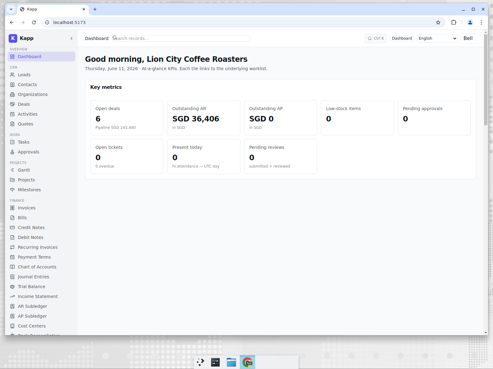
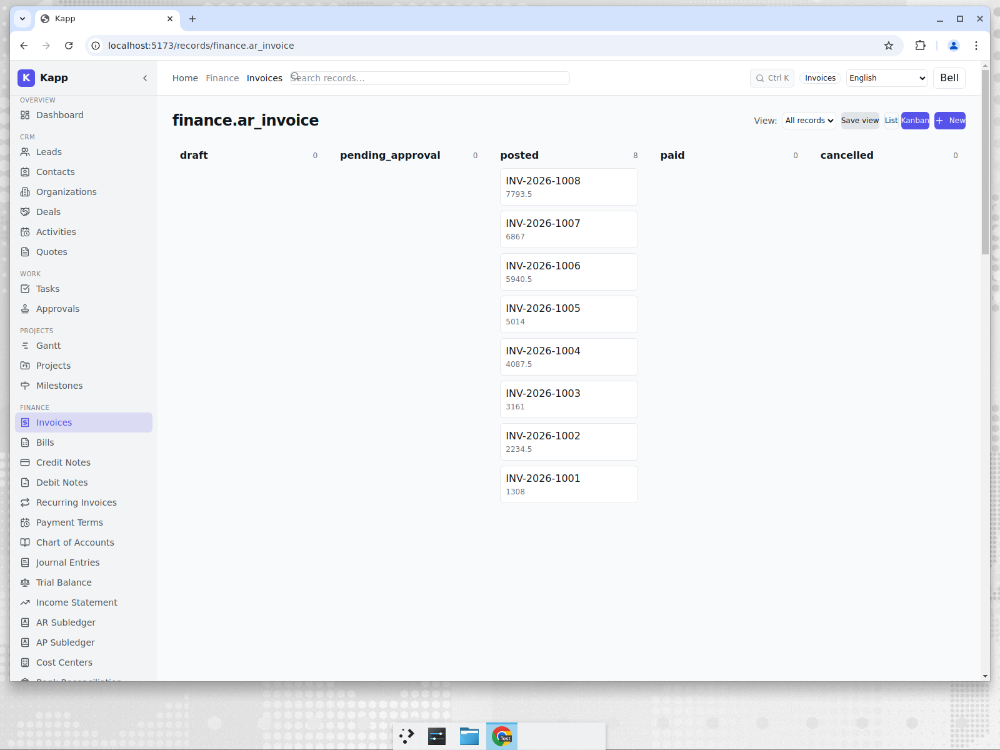
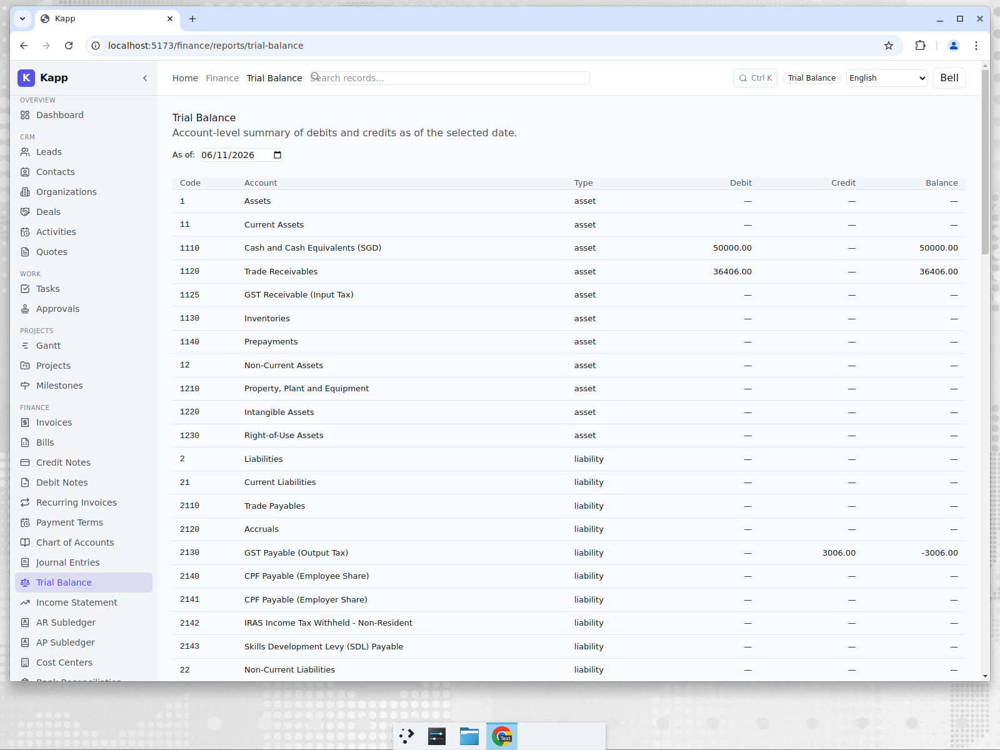
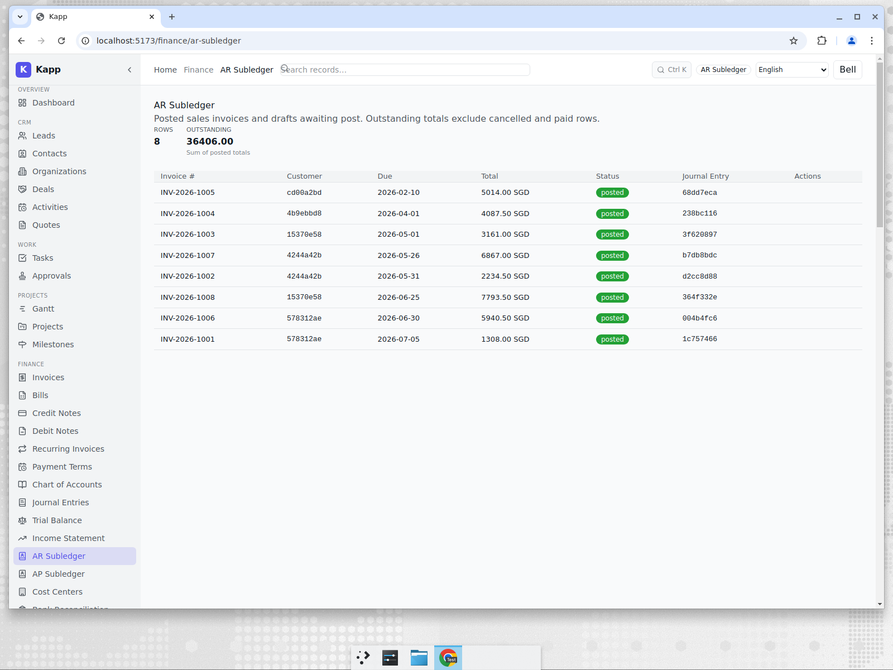
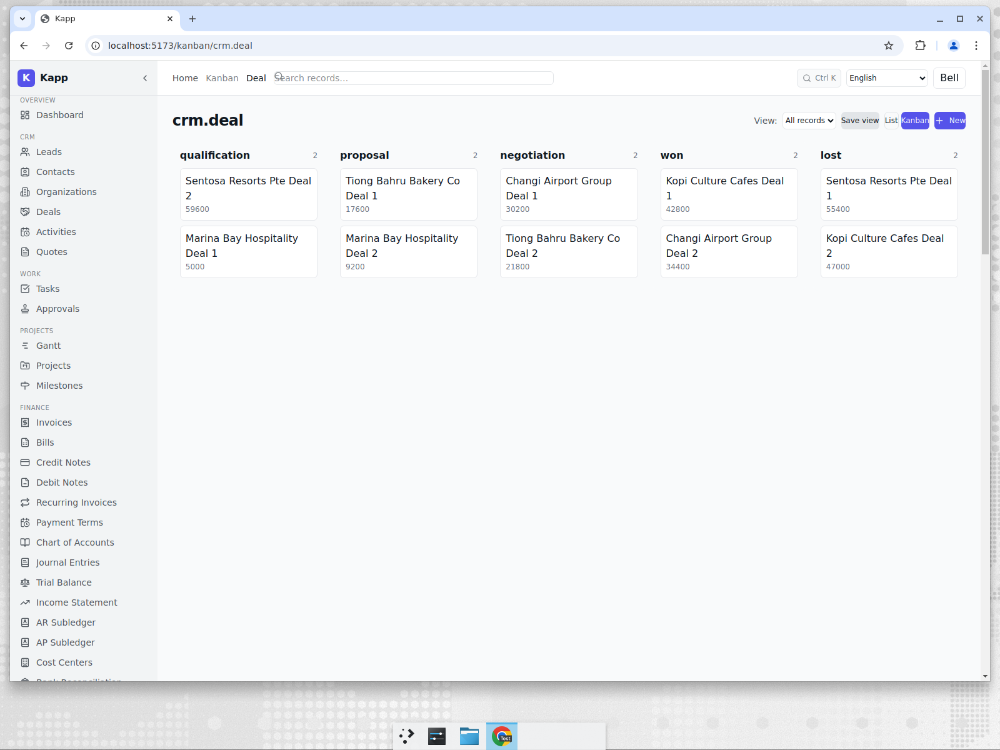
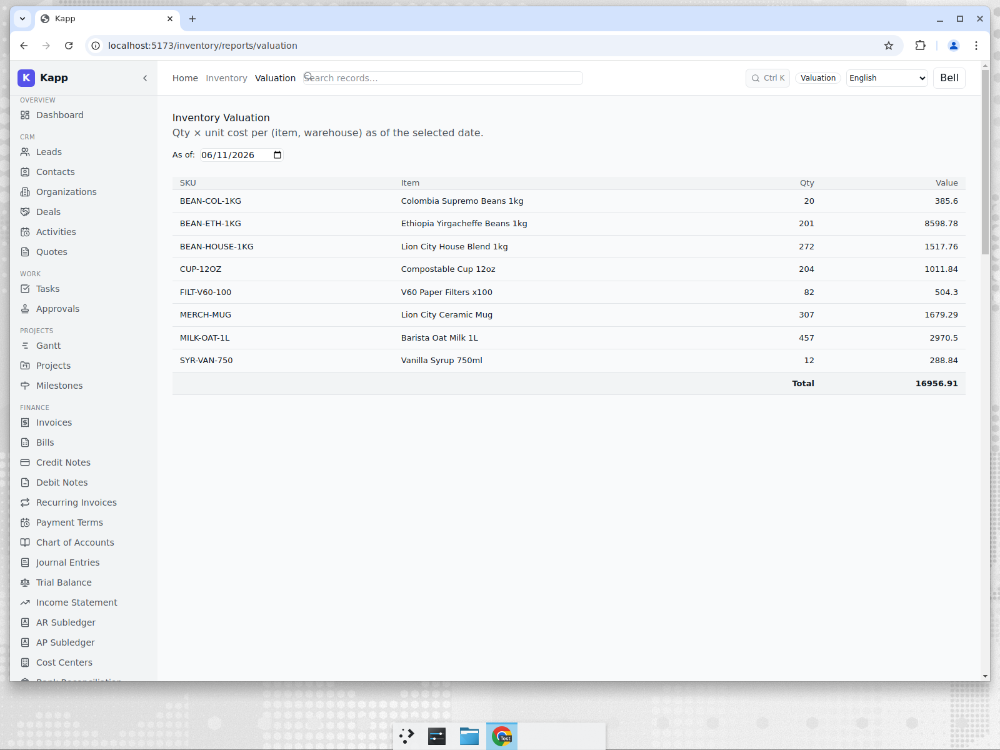

# Finance for a Singapore Coffee Roaster

**Tenant:** Lion City Coffee · 🇸🇬 Singapore · SGD · Coffee & Hospitality
**Persona:** Mei, the finance lead. Her job-to-be-done at month end: get invoices
out, know what customers owe, and produce a trial balance she can hand to the
external accountant — without exporting to spreadsheets.

## The morning view

Mei starts on the dashboard. Every tile is a live count that links straight to the
underlying worklist, so "Outstanding AR" is not a static number — it is the sum of
posted, unpaid invoices and clicking it opens exactly those records.

## Getting invoices out

Invoices move along a status pipeline — `draft → pending_approval → posted → paid`
— shown as a kanban so Mei can see what is stuck waiting for approval versus what is
already posted to the ledger. This is the same kanban infrastructure used across the
product (deals, work orders, hiring), so there is nothing new to learn.

The important detail for an SME: **posting an invoice writes the journal entry
automatically.** There is no separate "send to accounting" step and no nightly batch.
The AR control account and the revenue account move in the same database transaction.

## The trial balance, on demand

At any point Mei can pull a trial balance as of a chosen date. It is computed
directly from journal lines, so it always ties out — debits equal credits — and it is
denominated in the tenant's base currency (SGD) with a Singapore-localised chart of
accounts.

## Tracing a number back to its source

The part finance teams actually care about: when the trial balance shows a receivables
balance, can you prove it? The AR subledger lists every posted invoice making up the
control-account balance, and each line traces to the originating invoice and its
journal entry.

This closes the loop: **dashboard tile → invoice → journal entry → trial balance →
subledger**, all from the same posted records. There is no reconciliation between a
"CRM number" and an "accounting number" because there is only one number.

## Bonus: the pipeline that feeds finance

Because CRM and Finance share the same platform, the deals that will *become* invoices
are one click away on the same login. Mei's colleague in sales works the pipeline; the
revenue it closes lands in the same ledger Mei reports on.

## And the beans on the shelf

A coffee roaster also holds real stock — green beans, roasted bags, packaging. The
inventory valuation report values that holding in SGD from the same append-only moves
ledger that feeds the cost of goods Mei reports, so the stock figure on the operations
screen and the inventory line on the books are one and the same number.

## Why this matters for an SME

A Singapore café group does not have a controller and a separate FP&A team. The value
here is that one person can run invoicing, see the cash position, and produce
statutory-shaped reports without stitching together Xero + a CRM + a spreadsheet. The
honest trade-off — see [post 7](./07-competitive-analysis.md) — is that a pure-play
tool like Xero has a more polished bank-rec and a deeper accountant ecosystem today.
Kapp's bet is that *integration* beats *polish* for a growing multi-function SME.
