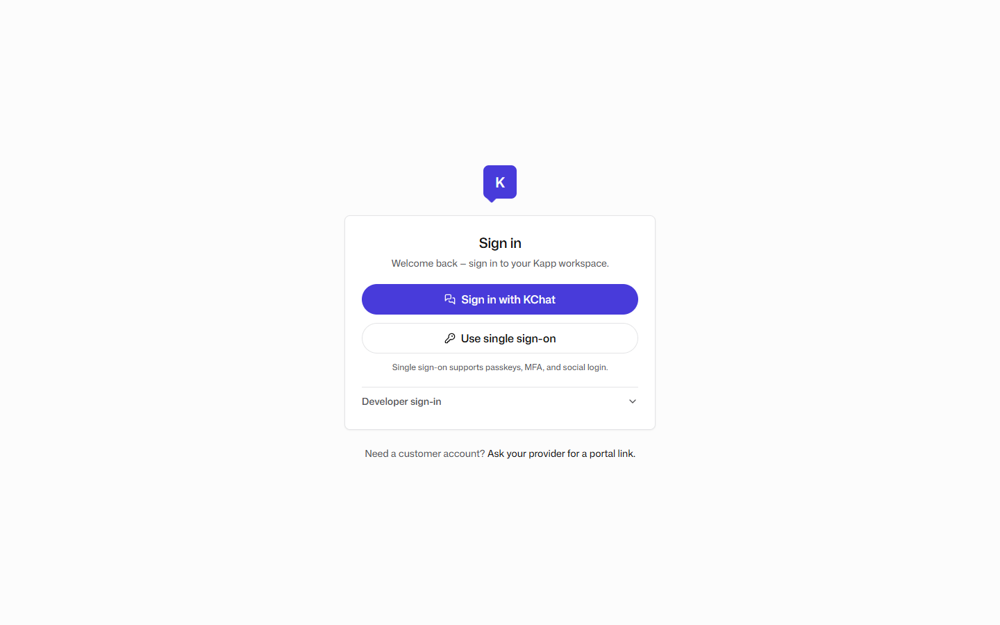
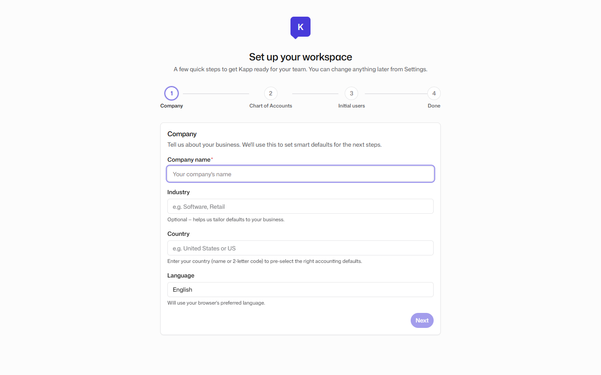
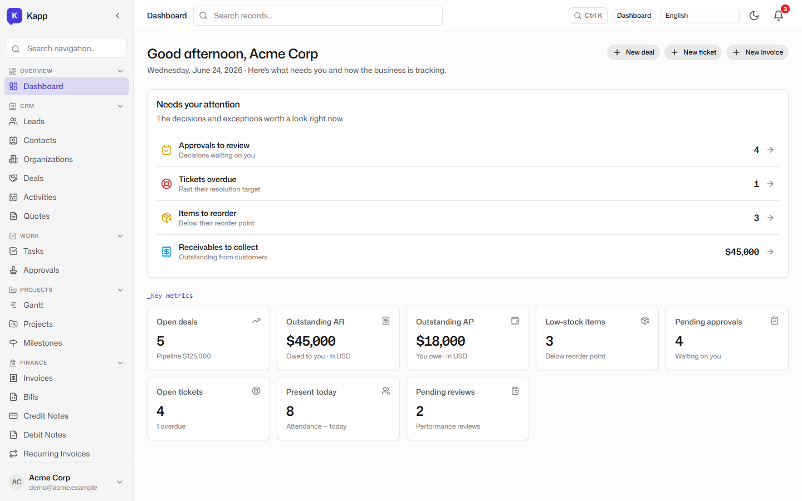
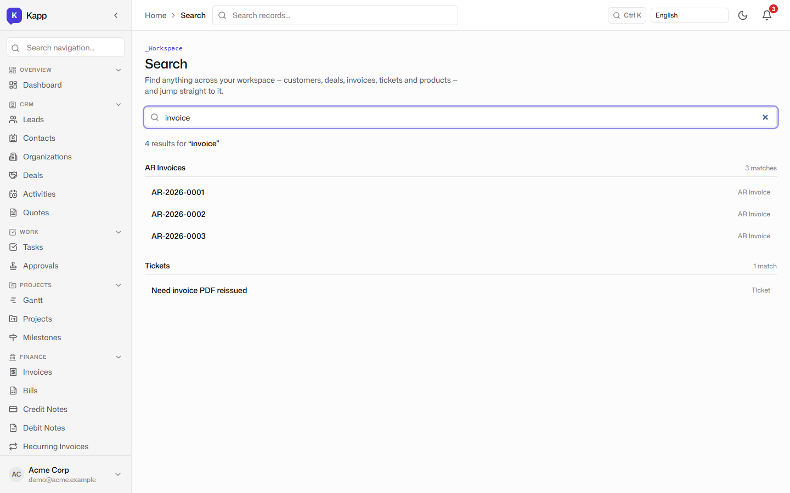

# Getting Started: Login, Setup, and the Overview Dashboard

**Tenant:** Acme Corp · USD · Multi-function SME demo
**Persona:** Alex, the operations owner who just signed up and wants to see whether the platform can run the business from day one.

## Sign-in

The sign-in page is intentionally minimal. It accepts KChat SSO or email credentials, sets the tenant context in the app shell, and lands the user on the overview dashboard. No onboarding wizard blocks the first click.

## Provisioning a new tenant

Behind the scenes, the demo tenant has already been created, but the setup wizard is still shown for the seeded UUID. The wizard collects the business name, base currency, locale, and the statutory tax pack that will shape the chart of accounts and withholding rules. This is the same flow a real customer follows.

## The overview dashboard

After sign-in, Alex lands on a dashboard that is more than a pretty welcome page. Each tile is a live count over the same underlying records, and each count links to the corresponding worklist:

- **Open deals:** 5 opportunities worth $125,000 in pipeline.
- **Outstanding AR:** $45,000 owed by customers.
- **Outstanding AP:** $18,000 owed to suppliers.
- **Low stock items:** 3 products below their reorder point.
- **Pending approvals:** 4 invoices, deals, or other records waiting for sign-off.
- **Open tickets:** 4 helpdesk requests, 1 overdue.
- **Present today:** 8 people clocked in.
- **Pending reviews:** 2 goals or feedback cycles awaiting action.

The dashboard is the first proof that CRM, finance, inventory, helpdesk, and HR all share the same data model. The AR number is not imported from another system; it is the sum of posted invoices from the finance ledger.

## Universal search

Kapp does not silo search by module. The global search bar accepts plain terms like "invoice" and returns records from CRM, finance, sales, and helpdesk in one ranked list. From any page, Alex can jump straight to a customer, a posted invoice, a deal, or a ticket without first deciding which app it lives in.

## Why this matters for an SME

A small business owner does not have a dedicated CRM admin, a finance controller, and an HR systems manager. The value on the first day is that one login exposes the whole business: the pipeline, the cash position, the stock position, and the day's operational exceptions. The rest of this series shows how each module turns that overview into action.
