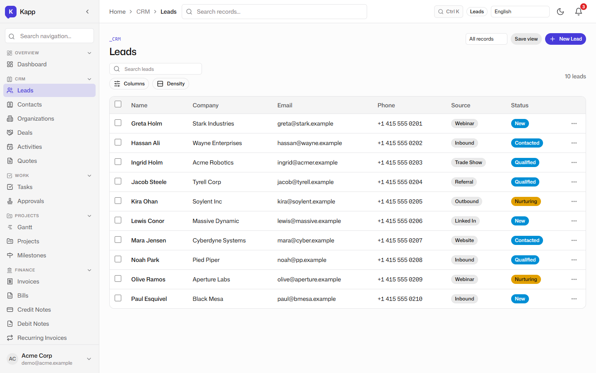
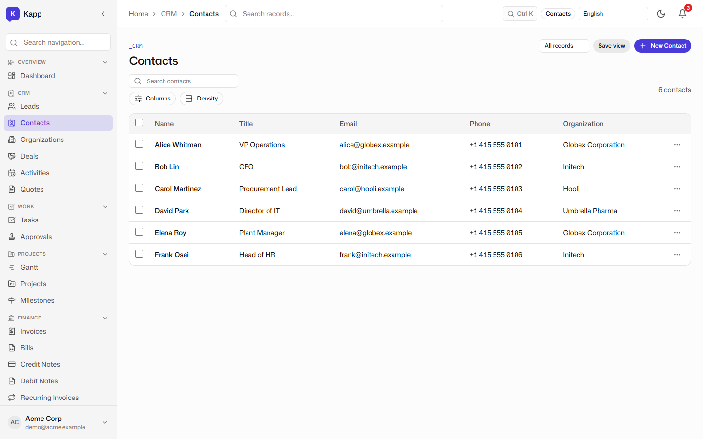
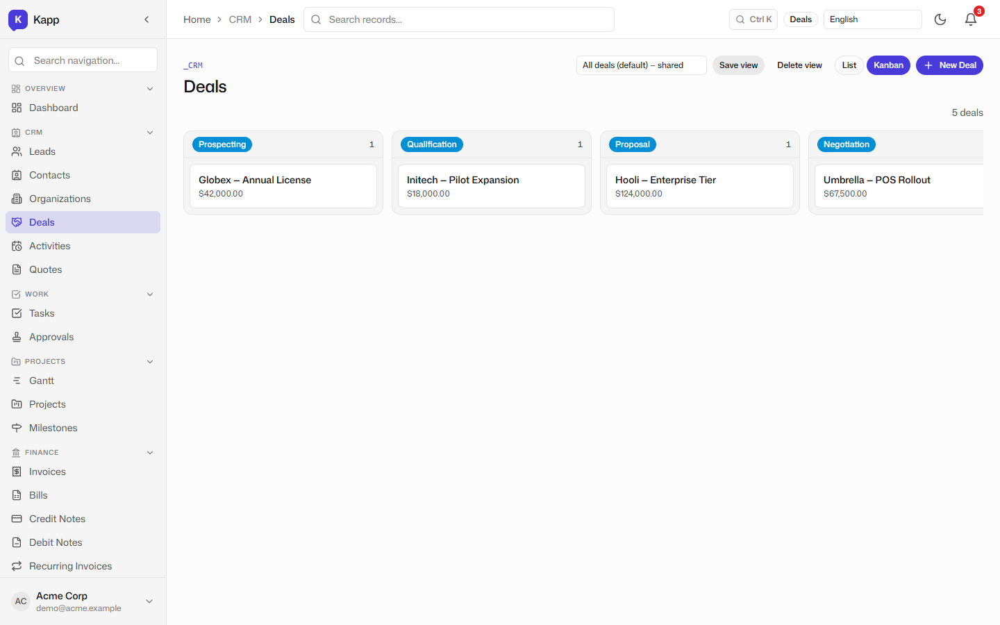
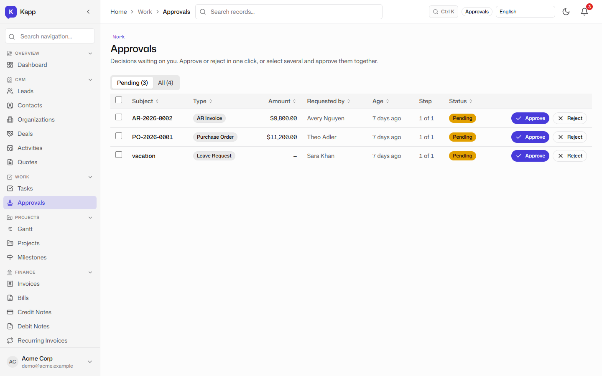
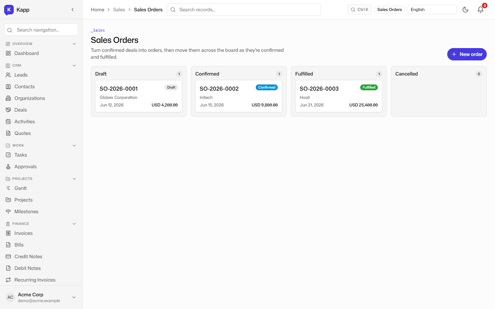
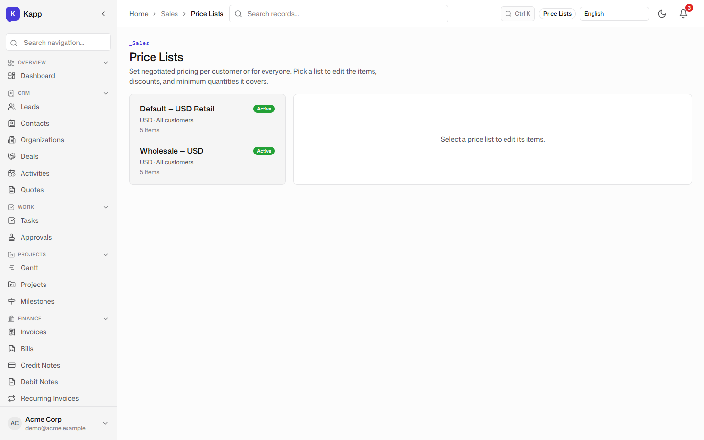
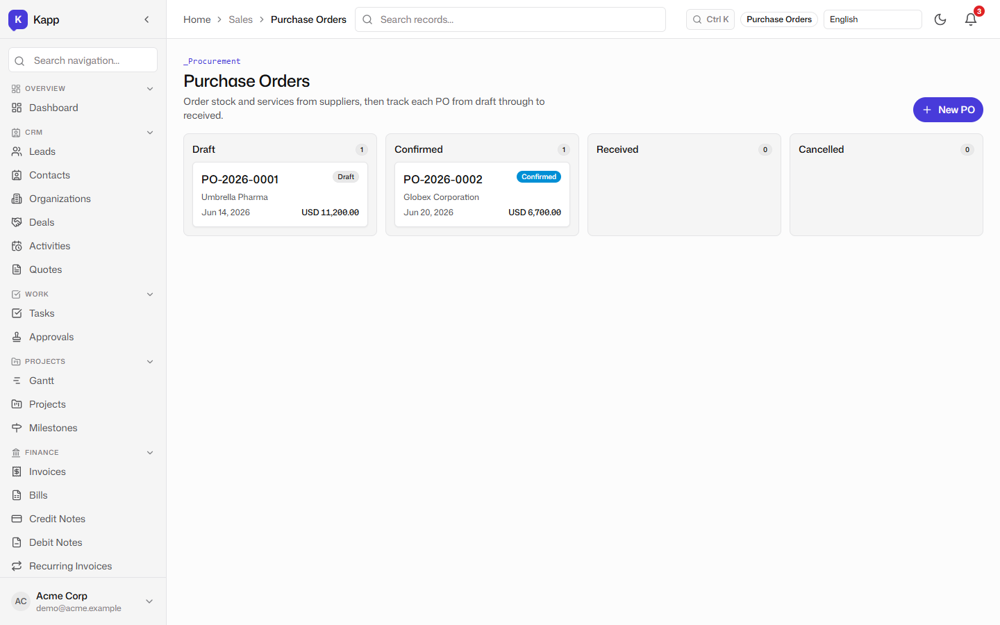
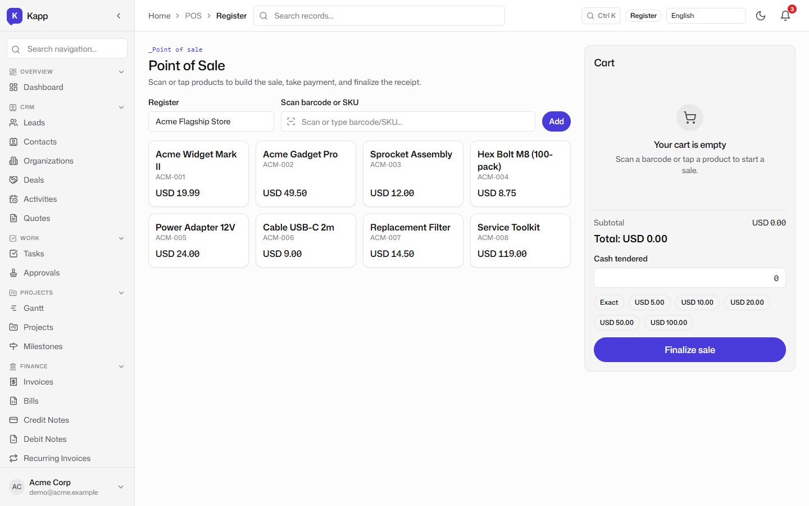

# CRM & Sales: Leads, Contacts, Deals, and Approvals

**Tenant:** Acme Corp · USD · Multi-function SME demo
**Persona:** Priya, the VP of Sales. Her job-to-be-done: keep the top of the funnel clean, the pipeline honest, and the back-office hand-offs fast enough that nothing falls through the cracks.

## Leads and contacts as first-class records

Leads and contacts are stored as KRecords, not as rows in a separate CRM-only database. The lead list shows source, status, and owner, and any lead can be converted into a contact or deal without re-keying.

The contact list ties people to their organizations, so Priya always knows that Alice Whitman is VP Operations at Globex Corporation and that Bob Lin is the CFO at Initech.

## The deal pipeline

Deals are visualized as a kanban board grouped by stage. The card carries the account name and the deal value, so the pipeline is readable at a glance. In the demo, the Hooli Enterprise Tier deal at $124,000 is in proposal, while the Globex Annual License and Initech Pilot Expansion deals are earlier in the cycle.

Moving a card updates the underlying record, and the change is captured in the audit trail. The same pipeline value feeds the dashboard tile and the Insights reports shown later in the series.

## Work approvals

Not every sales action can happen without oversight. The approvals surface shows records that are pending, approved, or rejected, with the approver and the business object that triggered the workflow. An invoice over a threshold, a discount on a deal, or a purchase order can all route through the same approval engine.

Because approvals are part of the platform, a record does not leave the system to ask for permission. It stays in the same ledger, and the approver sees the context that matters.

## Sales orders and price lists

Sales orders turn the pipeline into fulfilled commitments. The orders list shows order number, customer, date, total, and status, all in the tenant's base currency. The price list surface shows the active pricing matrices that drive quotes and orders, so the sales team is not guessing which price applies to which customer tier.

## Procurement and the point of sale

The same platform that manages sales also manages procurement. Purchase orders follow the same pattern: supplier, date, total, status, and a posting path to the ledger when received. The POS register shows that Kapp can also operate at the counter, writing invoices and stock moves from a simplified checkout UI.

## Why this matters for an SME

A growing SME typically buys a CRM, a sales-order tool, a procurement tracker, and an approvals add-on, then reconciles them every month. Kapp's CRM and sales surfaces are not trying to out-feature HubSpot on marketing automation; they are trying to remove the seams between the deal, the order, the invoice, and the receivable. The next post shows how those invoices become real ledger entries.
