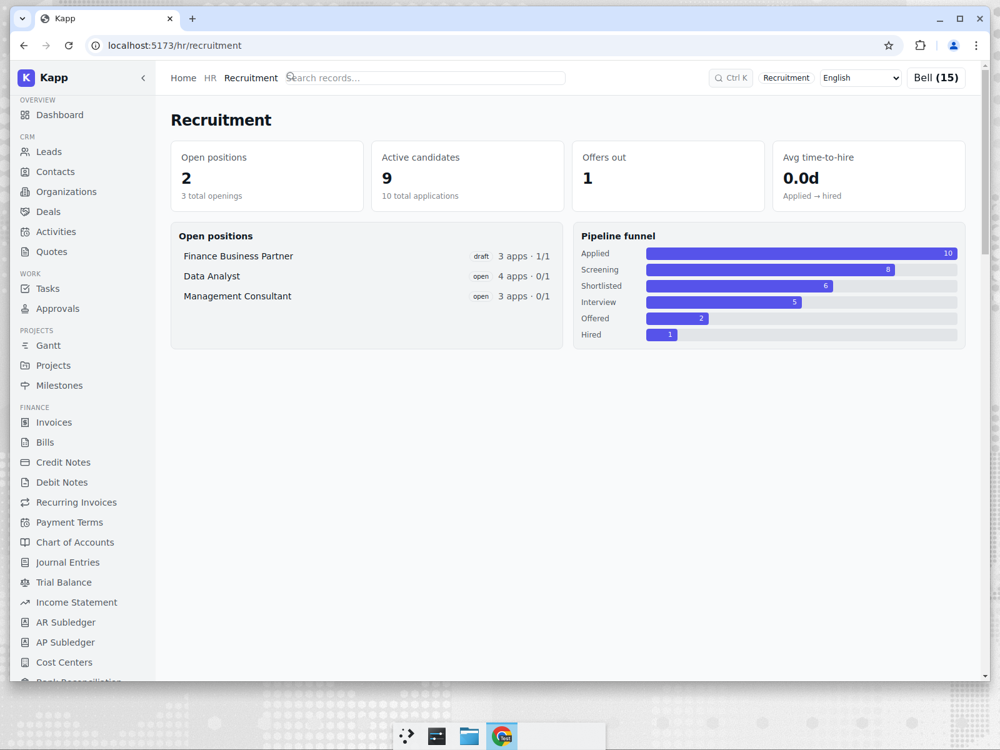
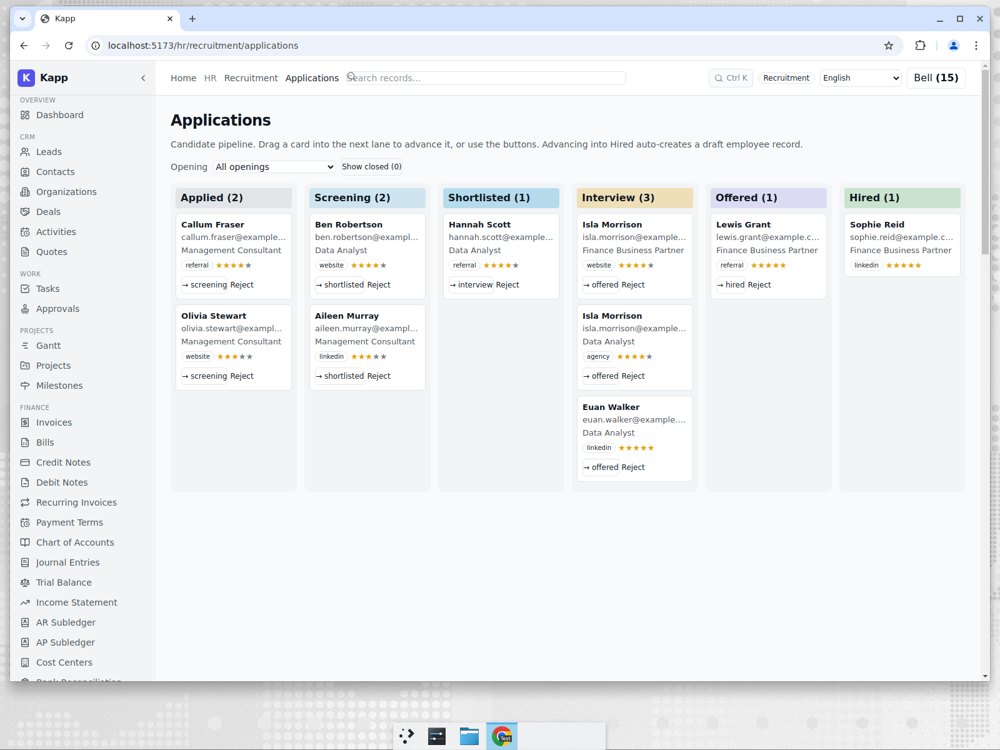

# Recruitment for a UK Consultancy

**Tenant:** Thistle & Oak · 🇬🇧 United Kingdom · GBP · Professional Services
**Persona:** James, the People lead. His job-to-be-done: fill two open roles without
losing candidates in inboxes and spreadsheets, and hand a clean pipeline to the
partners who interview.

## The hiring overview

The recruitment dashboard answers the first question a hiring manager asks — "where do
we stand?" — with open positions, active candidates, outstanding offers, and a funnel
that shows how candidates flow from *Applied* through to *Hired*.

In this snapshot Thistle & Oak has 2 open positions, 9 active candidates, and 1 offer
out — the kind of numbers a 30-person consultancy actually runs with.

## Working the pipeline

Applications are the primary working surface, shown as a drag-to-advance kanban with a
lane per stage: **Applied → Screening → Shortlisted → Interview → Offered → Hired**
(plus Rejected/Withdrawn). Each card carries the candidate name, a star rating, and the
source it came from (referral, LinkedIn, agency, website), so partners can prioritise at
a glance.

Moving a card is not just cosmetic. Advancing a candidate validates the status
transition and writes an audit entry, and when an application reaches **Hired** the
platform drafts an employee record pre-filled from the application — so the same person
flows from candidate to onboarding without re-keying.

## Why this matters for an SME

A consultancy this size would otherwise run hiring out of a shared mailbox and a
spreadsheet, or pay for a standalone ATS that doesn't know anything about payroll or
the org chart. Because recruitment lives in the same platform as HR, the hand-off from
*offer accepted* to *employee onboarded* is one system, one audit trail, gated behind
the `recruitment` feature flag so tenants who don't need it never see it.

The honest comparison: dedicated ATS products (Greenhouse, Lever) have richer sourcing,
careers-site, and interview-scheduling automation. Kapp's advantage is that the
candidate who says yes becomes an employee in the *same* system that already runs leave,
payroll, and the LMS onboarding path described in [the next post](./03-lms-uk.md).
