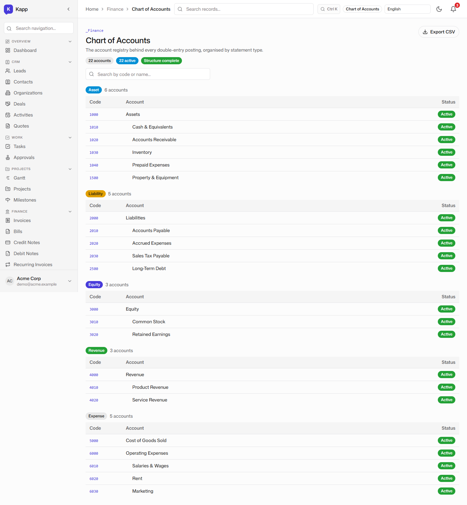
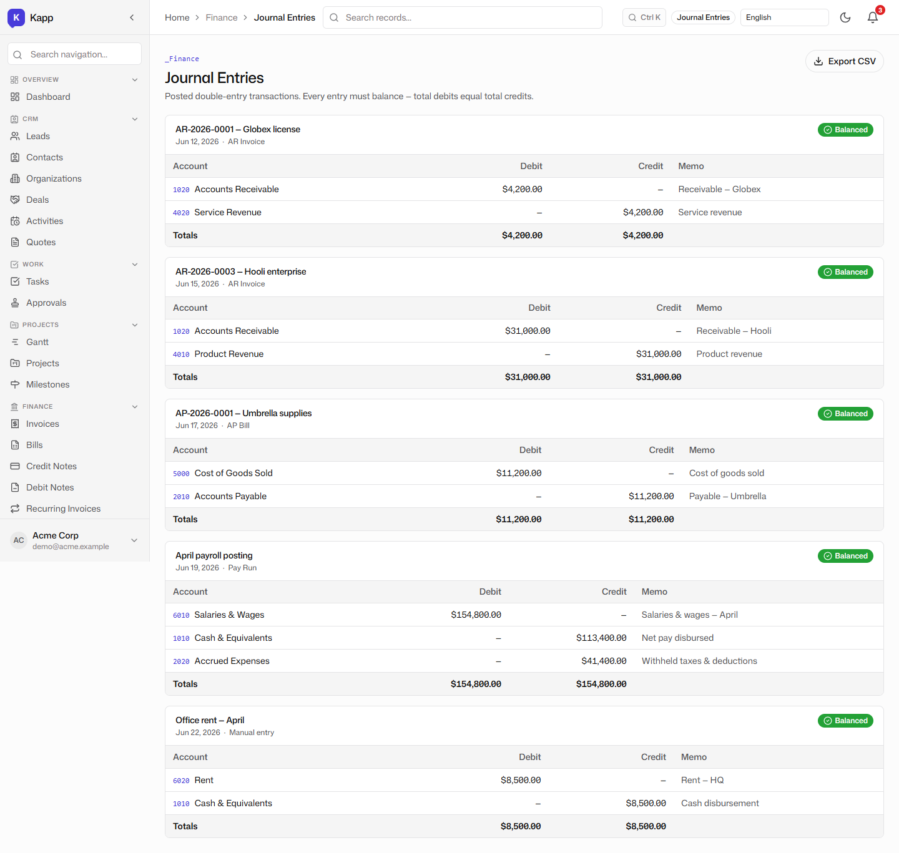
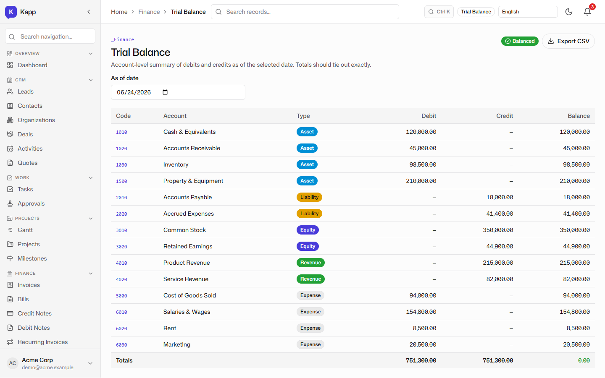
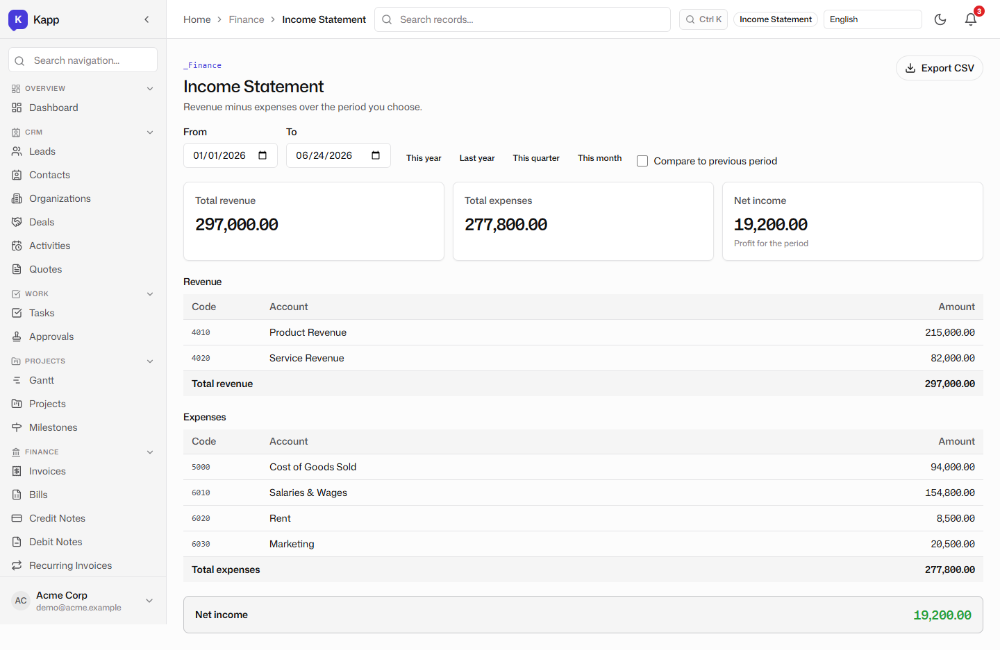
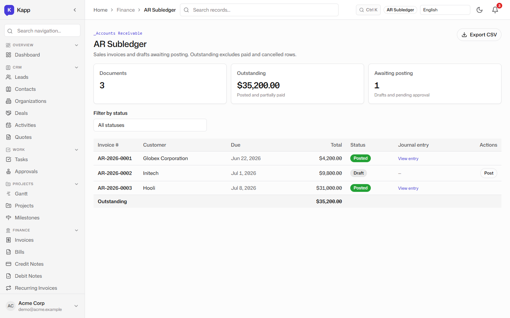
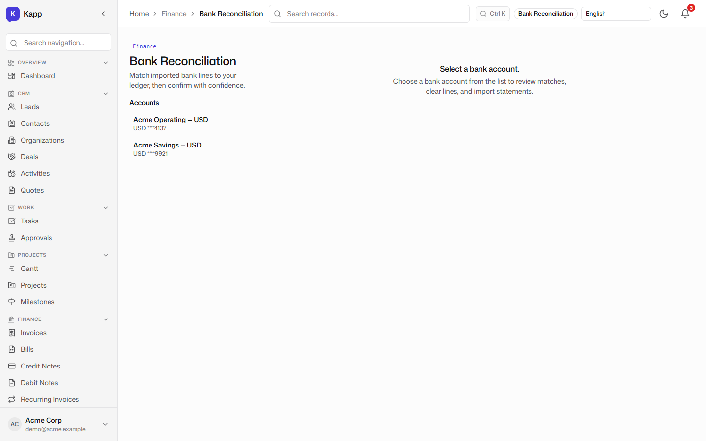
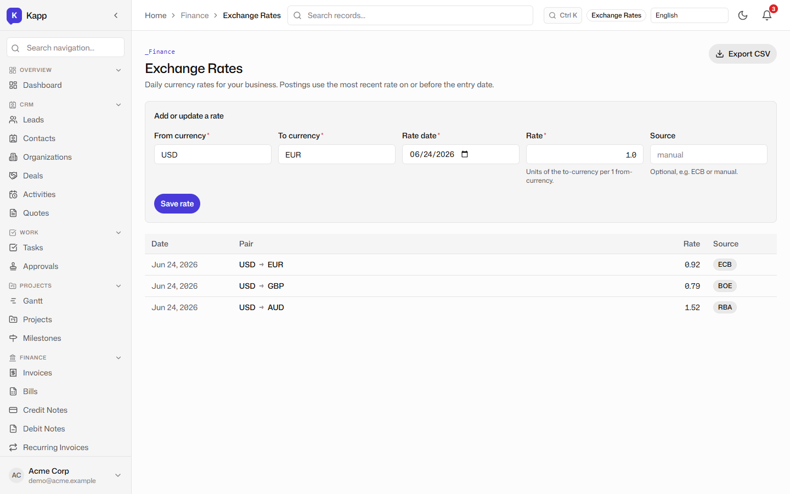
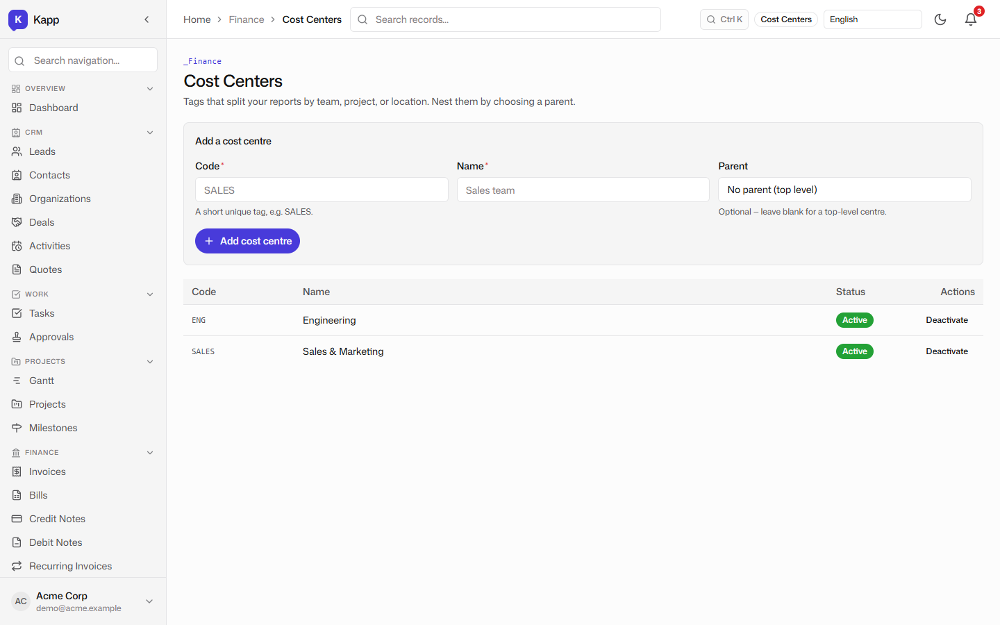
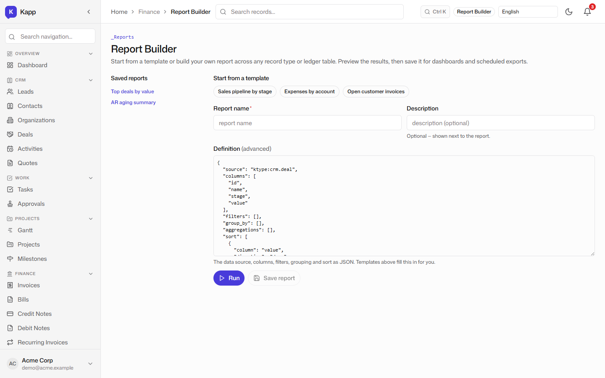

# Finance & Reporting: Chart of Accounts to Trial Balance

**Tenant:** Acme Corp · USD · Multi-function SME demo
**Persona:** Mei, the finance lead. Her job-to-be-done: close the books accurately, know what customers owe, and produce reports that an accountant can trust without exporting to spreadsheets.

## The chart of accounts

The finance module starts with a real, hierarchical chart of accounts. Assets, liabilities, equity, revenue, and expenses are organized by account code and type, and the chart is seeded from the tax pack selected at setup. Mei can add accounts, but the structure is already shaped for a US-based SME.

## Journal entries

Journal entries are the source of truth. Every posting is a debit/credit line with an account, a date, and a description. When a sales invoice is posted, the journal entry is created automatically in the same database transaction as the invoice status change. There is no separate "send to accounting" step and no nightly batch.

## The trial balance

Because the trial balance is computed directly from journal lines, it always ties out: debits equal credits. Mei can run it as of any date and see the balance of every account in the tenant's base currency. The AR control account, revenue accounts, and bank accounts all roll up from the same ledger.

## The income statement

The income statement gives the same ledger data in a management view. Revenue and expense accounts are summarized into a P&L that Mei can use to answer the question, "Are we profitable this month?" without opening a separate reporting tool.

## Tracing AR to its source

The part finance teams actually care about is traceability. When the trial balance shows a receivables balance, the AR subledger lists every posted invoice that makes up the control-account balance. Each line links back to the originating invoice and its journal entry.

This closes the loop: **dashboard tile → invoice → journal entry → trial balance → AR subledger**, all from the same posted records.

## Bank reconciliation, multi-currency, and cost centers

Bank reconciliation matches posted transactions against bank statement lines. The demo shows the matching surface, including automatic suggestions and the ability to create missing ledger entries. Multi-currency support means exchange rates can be maintained for customers and suppliers who transact in other currencies, while the base currency remains USD. Cost centers add a second dimension to reporting so Mei can see P&L by department or project.

## The report builder

The built-in report builder lets Mei create and save custom reports over the ledger and KRecords without writing SQL. The same query engine is used by the Insights module, so a report can combine finance data, CRM data, and inventory data in one place.

## Why this matters for an SME

A small business does not have a controller and a separate FP&A team. The value here is that one person can run invoicing, see the cash position, and produce statutory-shaped reports without stitching together a CRM and a spreadsheet. The honest trade-off — covered in [post 7](./07-competitive-analysis.md) — is that a pure-play tool like Xero still has a more polished bank-feed experience and a deeper accountant ecosystem today. Kapp's bet is that *integration* beats *polish* for a growing multi-function SME.
