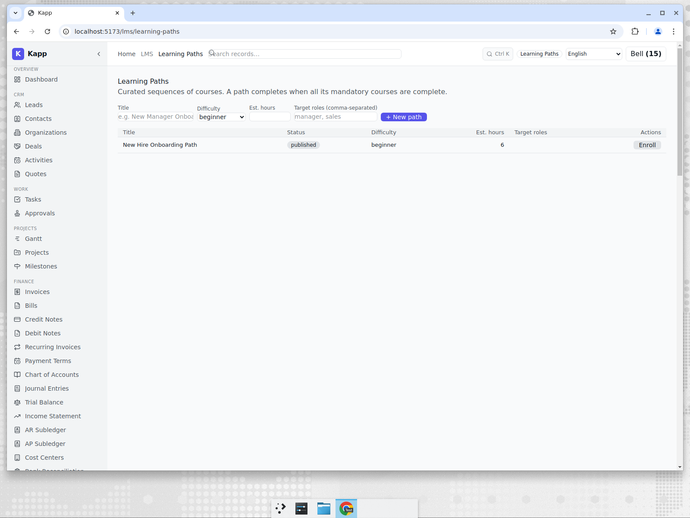
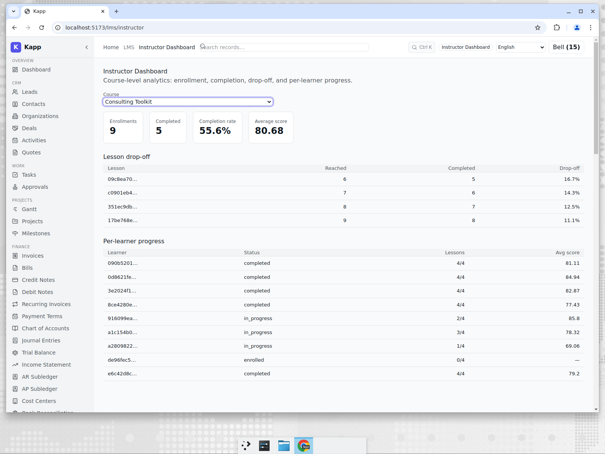

# Training & LMS for a UK Consultancy

**Tenant:** Thistle & Oak · 🇬🇧 United Kingdom · GBP · Professional Services
**Persona:** Priya, who owns enablement. Her job-to-be-done: make sure new hires
actually complete onboarding and the consulting team keeps its skills current — and
prove it to clients who audit supplier training.

## Structured learning, not a folder of PDFs

Instead of emailing course links, Priya builds **learning paths** — ordered sequences
of courses with mandatory/optional flags and an estimated duration. A new joiner is put
on the "New Hire Onboarding Path" and the platform tracks their progress through it.

Learning paths can auto-enrol people by role: when someone is assigned a role that
matches a path's target roles, they are enrolled automatically — so onboarding starts
the moment the new hire from [the recruitment post](./02-recruitment-uk.md) is created.

## The instructor's evidence

The part that turns "we have training" into "we can prove training" is the instructor
dashboard. For each course it computes enrolments, completion rate, average score, and a
**lesson-by-lesson drop-off table** showing exactly where learners stall.

For the *Consulting Toolkit* course shown here: 9 enrolments, 5 completed, a 55.6%
completion rate and an 80.7 average score — plus a per-learner table so Priya can chase
the specific people who haven't finished. These numbers are computed from real
enrolment records and per-lesson progress rows, not entered by hand.

## Why this matters for an SME

Buying a standalone LMS (TalentLMS, Docebo) means another login, another bill, and a
manual job to reconcile "who is an employee" with "who is a learner." Here the learner
*is* the employee, the onboarding path is triggered by the hire, and the completion
evidence sits next to the HR record an auditor would ask for.

The honest comparison — covered in [post 7](./07-competitive-analysis.md) — is that
Moodle and Docebo have far deeper course-authoring, SCORM/xAPI maturity, and a plugin
ecosystem. Kapp's LMS is intentionally "good enough and built in" for SMEs whose
training need is onboarding and compliance, not running a commercial training business.
