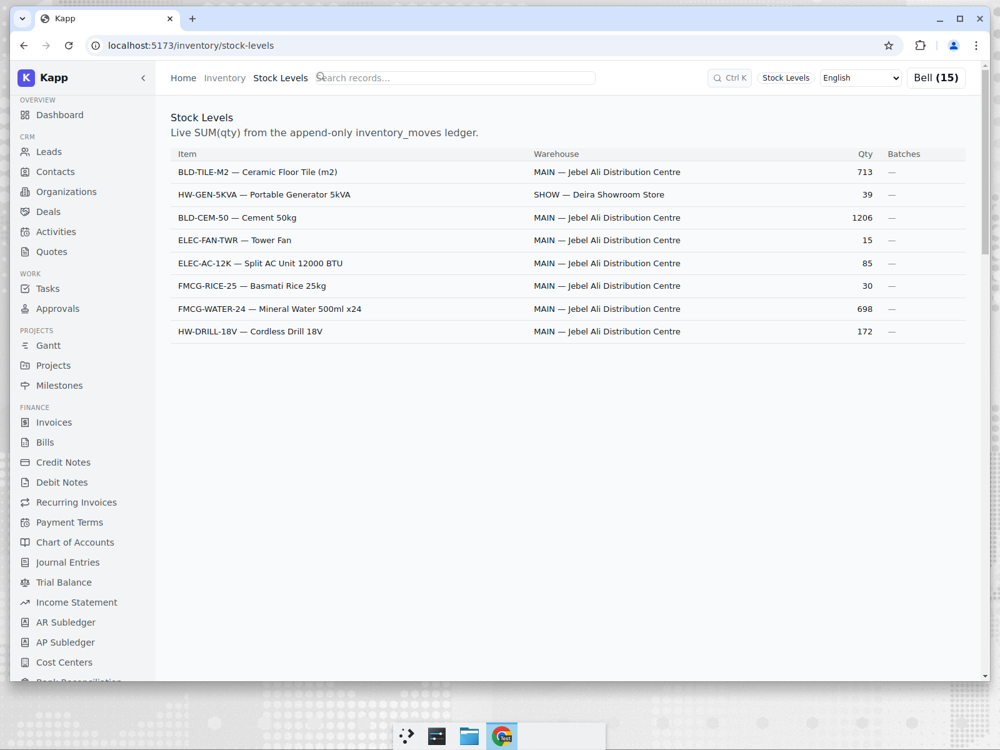
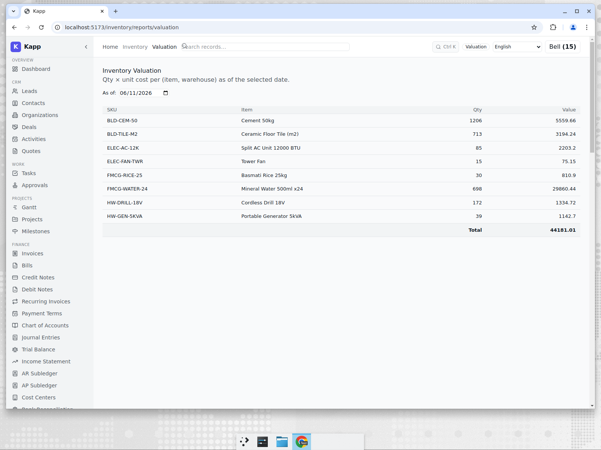

# Inventory for a Dubai Distributor

**Tenant:** Falcon Trading · 🇦🇪 UAE · AED · Wholesale & Distribution
**Persona:** Omar, operations lead. His job-to-be-done: know what stock he is holding,
where it physically sits, and what it is worth — across a distribution centre and a
showroom — without a Friday-night stock-count spreadsheet.

## Live stock, by warehouse

Falcon Trading holds inventory in two locations: the Jebel Ali Distribution Centre
(MAIN) and the Deira Showroom (SHOW). The Stock Levels view shows on-hand quantity per
item per warehouse, computed live from an **append-only inventory-moves ledger** — every
receipt, transfer, and issue is an immutable row, and the on-hand figure is their sum.

This matters because the stock number is *derived*, not *stored*. There is no balance
field that can drift out of sync with its transactions; if you can see the moves, you
can always explain the quantity.

## What is it worth?

The valuation report turns quantities into money. It values each item and totals the
holding in the tenant's base currency — here AED — across the catalogue of building
materials, appliances, and FMCG that a Gulf distributor carries.

Eight items, valued live at 44,181 AED. Because valuation reads the same ledger as the
stock-levels view, the number on the operations screen and the number a finance person
would post are the same number.

## Why this matters for an SME

A distributor's whole business is the gap between what stock costs and what it sells
for. The risk is always the same: the system says you have 40 units, the shelf has 12,
and nobody can say where the other 28 went. An append-only ledger makes that
investigable by construction — and keeping inventory in the same platform as AP/AR means
the cost of goods flows to the same ledger the [Singapore finance post](./01-finance-singapore.md)
describes.

The honest comparison: dedicated WMS products (and Odoo's deeper inventory module) offer
lot/serial tracking, barcode picking workflows, and multi-step routes that go beyond
what an SME distributor usually needs. Kapp covers multi-warehouse on-hand, valuation,
and reorder triggers — the 80% that a growing distributor lives on — without a separate
system. See [post 7](./07-competitive-analysis.md).
