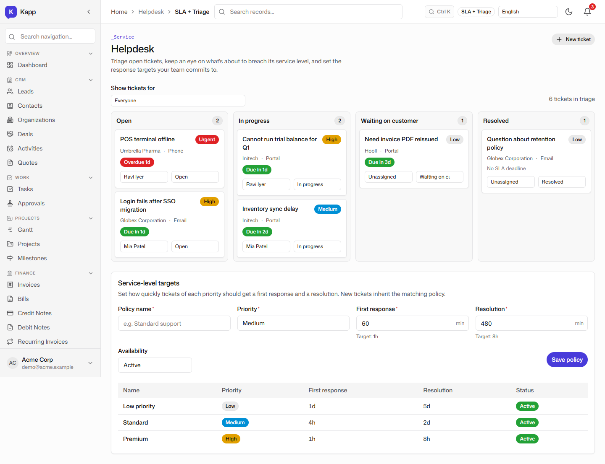
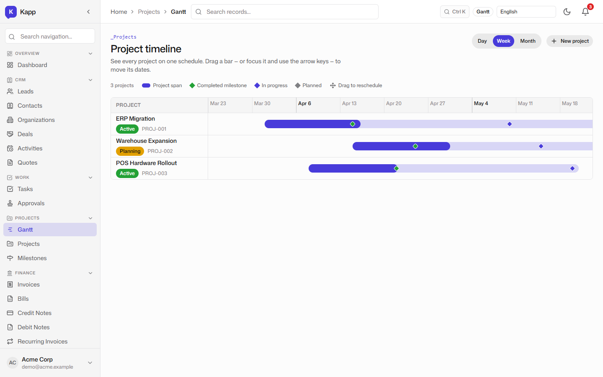
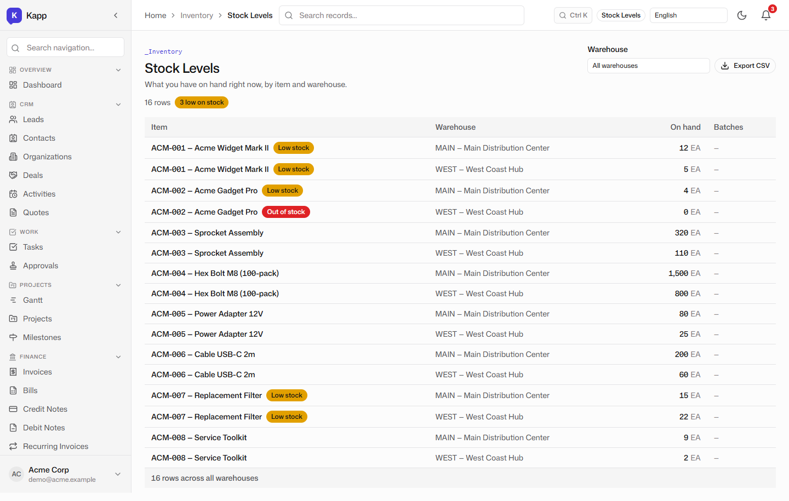
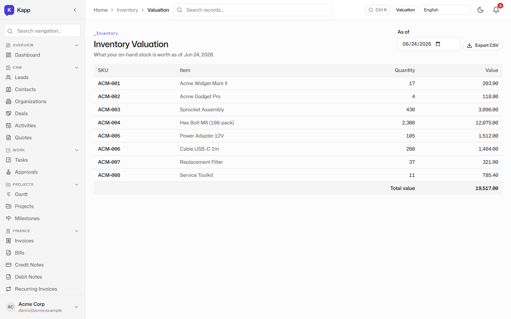
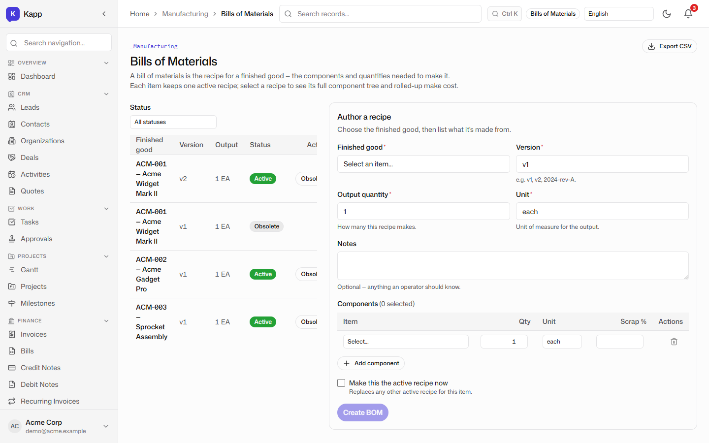
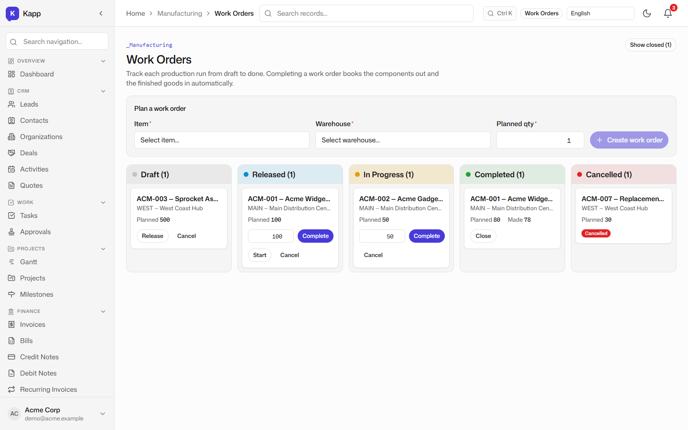
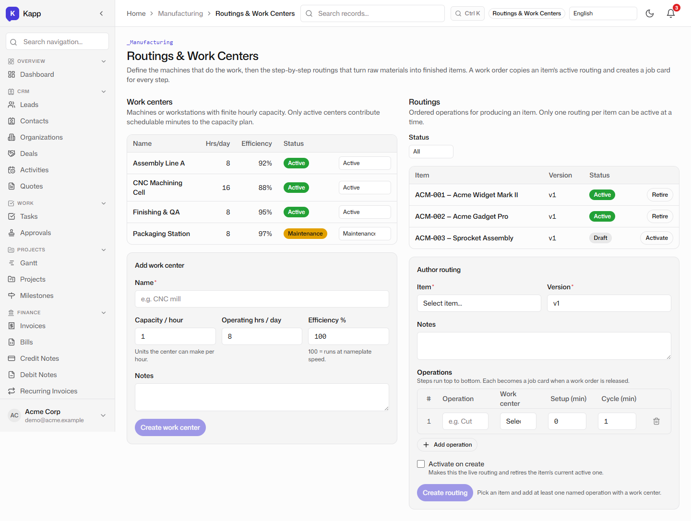
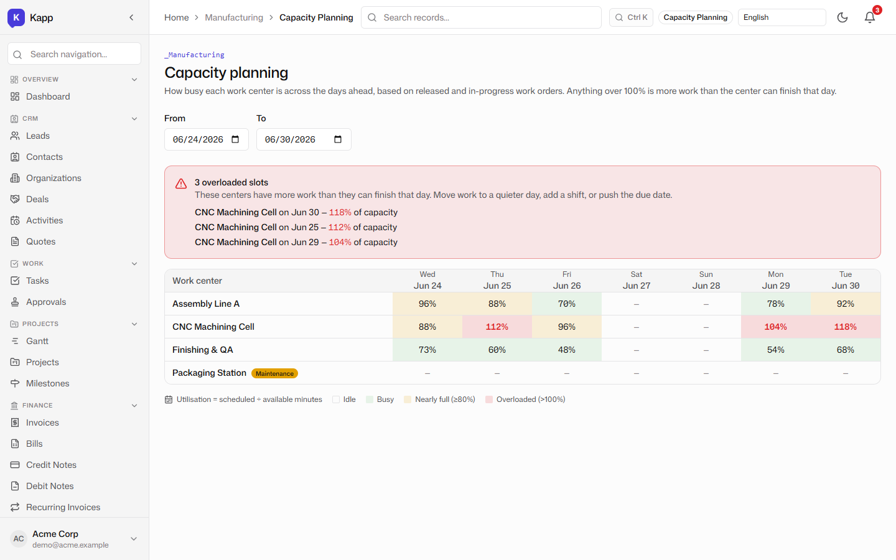
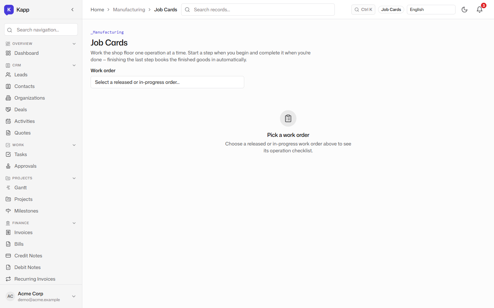

# Operations & Manufacturing: Helpdesk, Projects, Inventory, and the Shop Floor

**Tenant:** Acme Corp · USD · Multi-function SME demo
**Persona:** Carlos, the plant and operations manager. His job-to-be-done: keep service levels up, projects on track, stock honest, and the production floor inside its physical capacity.

## Helpdesk SLA triage

The helpdesk surface shows open tickets, priorities, and SLA targets. In the demo, 4 tickets are open and 1 is overdue, which matches the dashboard tile. The triage view lets the team assign, escalate, and track resolution without a separate ticketing system.

Because helpdesk is part of the same platform, a customer ticket can reference the same contact record that sales uses, and a ticket about a missing shipment can surface the linked sales order and inventory move.

## Project Gantt

Projects are tracked with milestones and a Gantt chart. The demo shows a 2026-Q2 project plan with fixed dates so the screenshot is stable across runs, but in production the dates would be relative to the current day. The Gantt links milestones to tasks and owners, giving a project view that sits next to HR, finance, and inventory rather than in a siloed project tool.

## Live stock levels by warehouse

Acme holds inventory in two locations: Main and West. The Stock Levels view shows on-hand quantity per item per warehouse, computed live from an append-only inventory-moves ledger. Every receipt, transfer, and issue is an immutable row, and the on-hand figure is the sum of those rows.

This matters because the stock number is *derived*, not *stored*. There is no balance field that can drift out of sync with its transactions; if you can see the moves, you can always explain the quantity.

## Inventory valuation

The valuation report turns quantities into money. It values each item and totals the holding in USD across the catalogue. Because valuation reads the same ledger as the stock-levels view, the number on the operations screen and the number a finance person would post are the same number.

## Bills of materials

Production starts with the recipe. The BOM surface lists each finished good, its version, and status. Only one BOM per item can be active at a time, so the shop floor never has to guess which recipe to build. Selecting a BOM opens a detail view that explodes the recipe into a component tree and rolls component costs up to a make cost.

## Work orders

Production runs are work orders on a kanban: Draft → Released → In Progress → Completed. The crucial behavior is at completion: finishing a work order emits component consumption and finished-goods receipt inventory moves atomically, in one transaction. Either the whole production posting happens or none of it does.

## Routings and work centers

Routings define the sequence of operations that turn raw materials into finished items. Each operation is assigned to a work center with a known capacity and efficiency. The routings surface shows which work centers are active, in maintenance, or retired, and which routing is active for each item.

## Capacity planning

The capacity planner is where Carlos earns his keep. It shows finite-capacity utilization per work center per day, derived from released and in-progress work orders. Cells over 100% are flagged as overloaded, so the bottleneck is visible immediately. The planner does not silently reschedule; it surfaces the conflict so Carlos can decide whether to add a shift, move a job, or push a delivery date.

## Job cards

Once a work order is released, the routing generates job cards: one per operation, with planned and actual start/end times, operator, and quantity produced or rejected. The job card surface gives the shop floor a simple, mobile-friendly checklist without printing paper travelers.

## Why this matters for an SME

A small manufacturer or distributor is usually forced to choose between a cheap accounting tool that knows nothing about the shop floor and a heavy MRP system that costs more than the business can justify. Kapp puts helpdesk, projects, inventory, BOMs, work orders, routings, capacity visibility, and job cards in one system. The honest comparison — see [post 7](./07-competitive-analysis.md) — is that dedicated MRP systems and Odoo's manufacturing module go further on full material requirements planning, subcontracting, and quality workflows. Kapp deliberately covers the core make-to-stock loop and the capacity *visibility* that most small shops lack.
