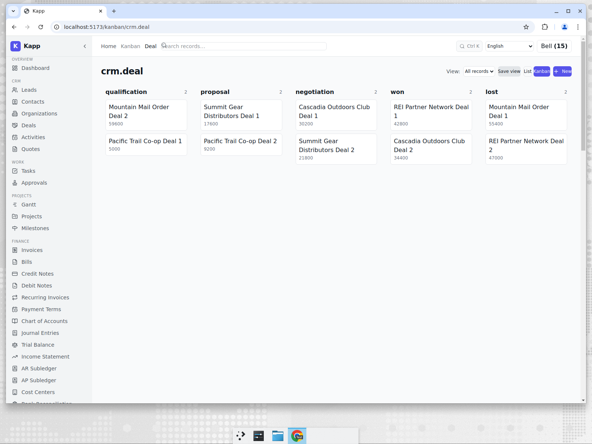
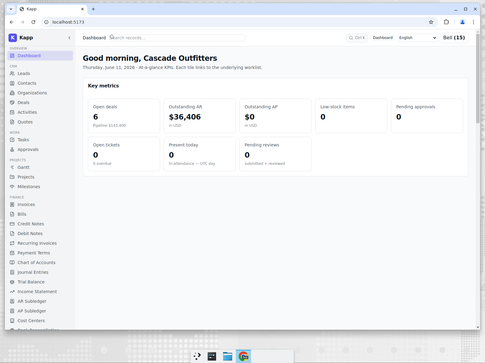

# CRM for a US Outdoor Retailer

**Tenant:** Cascade Outfitters · 🇺🇸 United States · USD · Retail / E-commerce
**Persona:** Dana, who runs wholesale sales. Her job-to-be-done: keep deals moving
through the pipeline and know, on any given morning, how much is in play and how much
cash is owed.

## The pipeline

Cascade sells to retail partners and co-ops, so its revenue runs through a deal
pipeline rather than a checkout. Deals sit on a kanban by stage —
**Qualification → Proposal → Negotiation → Won / Lost** — with the account name and
deal value on every card.

Dana can see at a glance that the REI Partner Network and Cascadia Outdoors deals are in
the Won column while Summit Gear and Pacific Trail are still being negotiated. Dragging a
card between stages updates the deal and is captured in the audit trail.

## The cash picture, same login

The dashboard rolls the pipeline up into the numbers Dana's GM asks about: open deals,
total pipeline value, and outstanding AR — all in USD because that is Cascade's base
currency.

Here: 6 open deals worth $143,400 in pipeline, and $36,406 of AR outstanding. The
pipeline figure comes from the CRM records; the AR figure comes from posted invoices in
the ledger — two views of the same business, one screen.

## Why this matters for an SME

A small wholesale brand usually buys a CRM (HubSpot, Pipedrive) and bolts on accounting
separately, then spends time every month reconciling "what sales think we'll close"
against "what finance says we've billed." Because the deal, the invoice it becomes, and
the receivable it creates live in one platform, that reconciliation largely disappears.

The honest comparison: HubSpot and Salesforce have vastly richer marketing automation,
lead scoring, email sequencing, and reporting. Kapp's CRM is a clean, functional
pipeline — its differentiator is not out-featuring HubSpot, it is that the pipeline is
wired to the same ledger, inventory, and fulfilment the rest of the business runs on.
Details in [post 7](./07-competitive-analysis.md).
