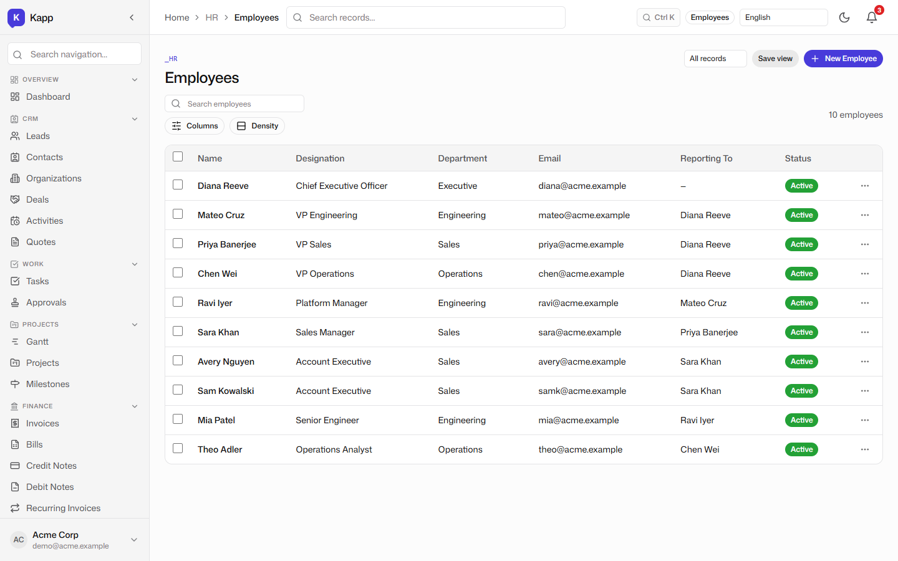
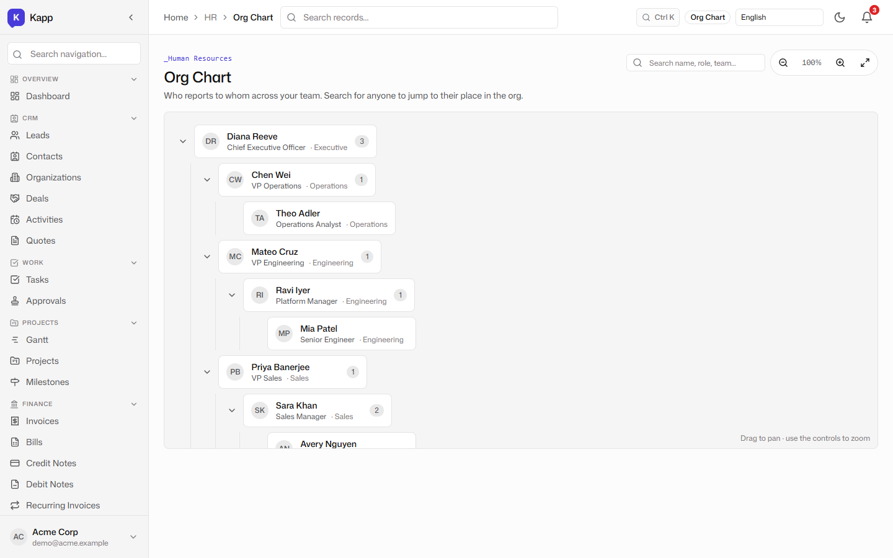
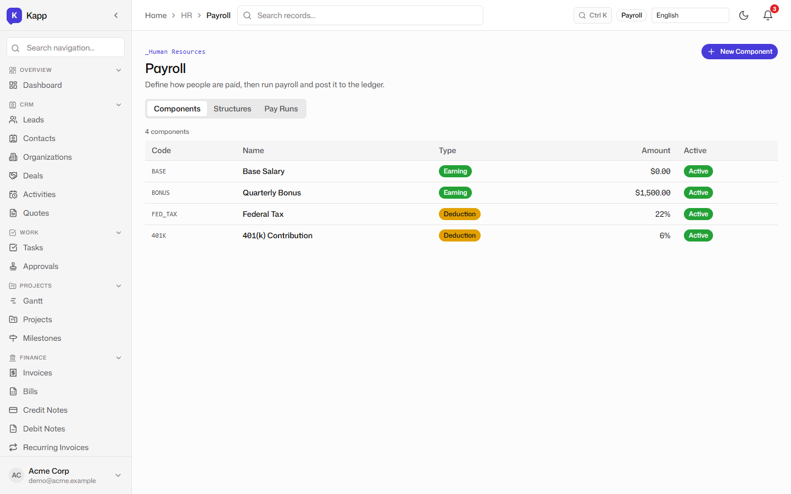
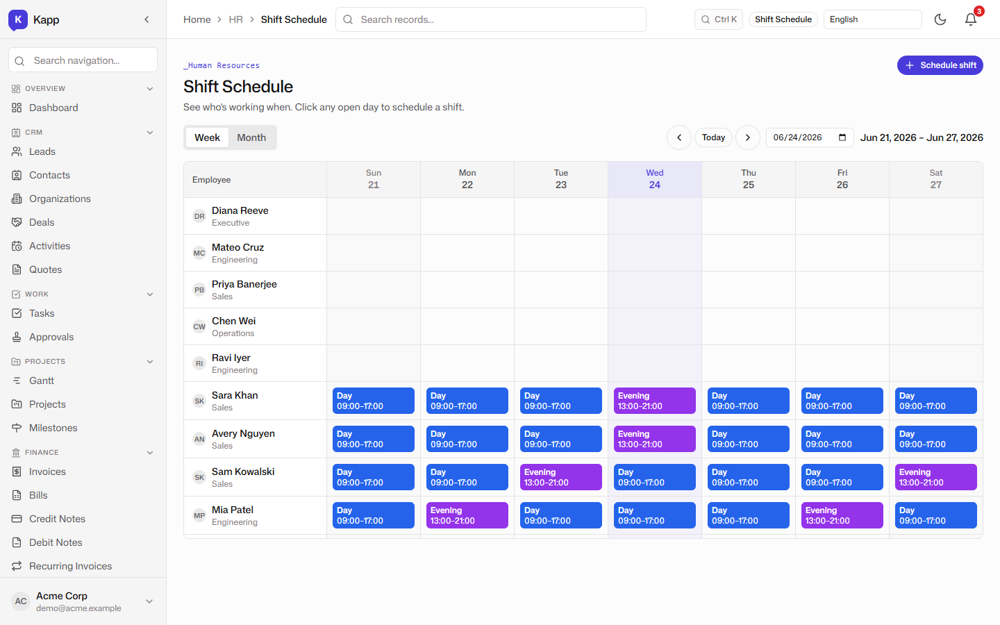
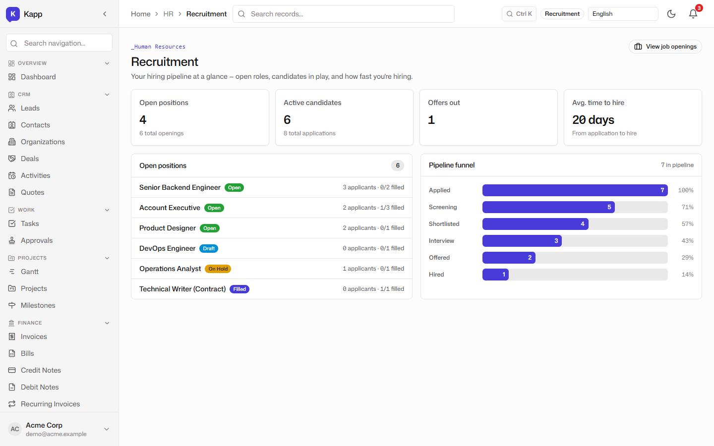
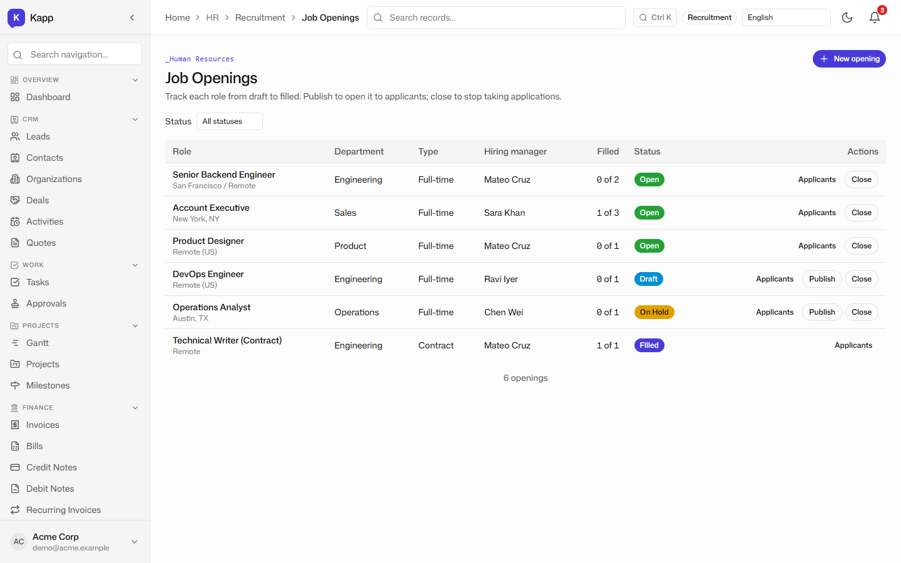
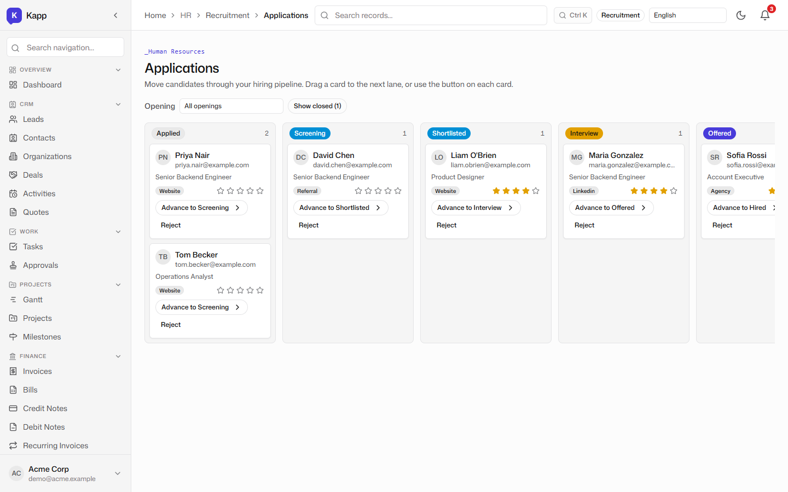
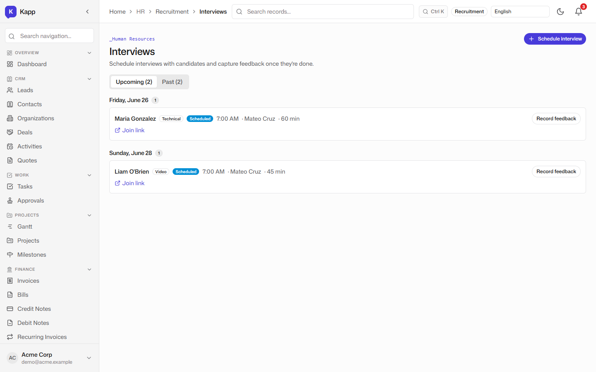
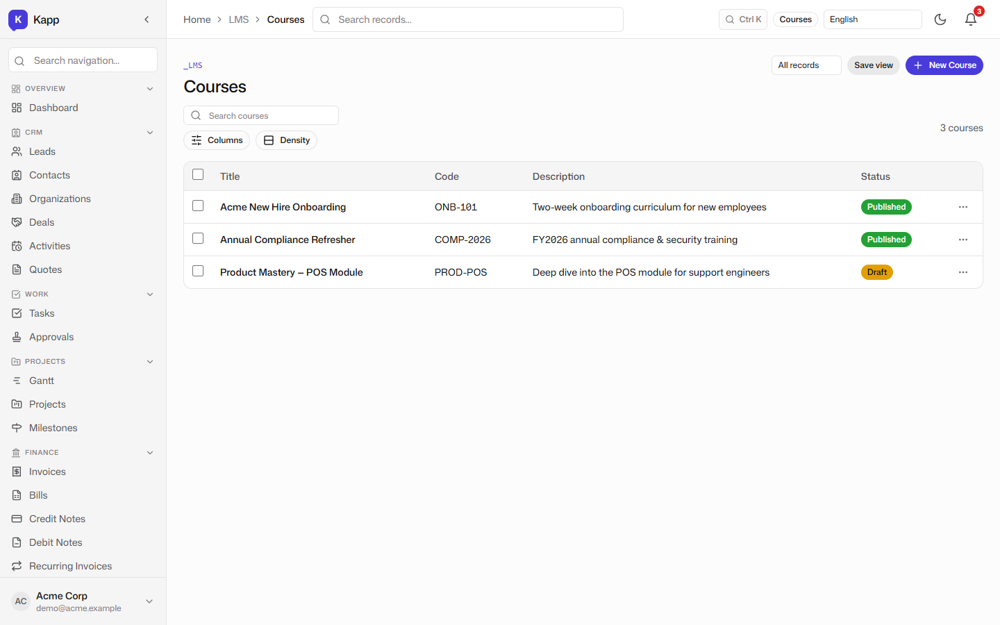
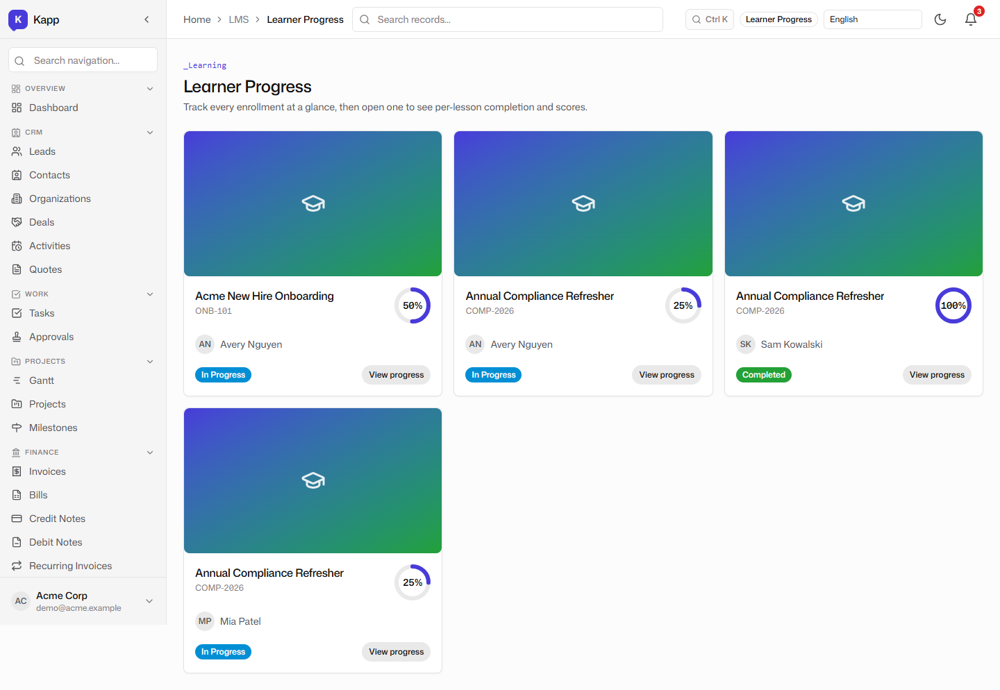

# People, Recruitment & Learning: HR, Org Chart, Payroll, Recruitment, and LMS

**Tenant:** Acme Corp · USD · Multi-function SME demo
**Persona:** James, the People lead. His job-to-be-done: know who works here, who reports to whom, when people are paid, and whether required training actually gets done.

## The employee directory

The HR module starts with a clean employee list. Each row shows name, designation, department, email, manager, and status. Because the employee is a KRecord, the same record can be referenced by approvals, sales deals, projects, payroll, and the LMS without maintaining a separate "HR master" export.

## The org chart

The org chart visualizes reporting relationships from the same employee records. The demo shows Diana Reeve as CEO, with Mateo Cruz leading Engineering and Priya Banerjee leading Sales. The chart is not a static diagram; it updates as the reporting structure changes.

## Payroll

Payroll runs compute earnings, deductions, and net pay from the employee's salary structure and the statutory tax pack selected at tenant setup. The demo shows a completed pay run with individual payslips, so James can see the full run rather than just a summary number.

## Shift calendar

For shift-based teams, the shift calendar shows who is assigned to which shift on which day. The demo shows a June 2026 calendar with shift types assigned to employees, giving managers a workforce scheduling view that sits next to the attendance and payroll data.

## Recruitment

The recruitment surface is gated by the `recruitment` feature flag, so tenants that do not hire through the platform never see it. The dashboard gives the hiring overview: open positions, active candidates, outstanding offers, and a funnel that shows how candidates move from *Applied* through to *Hired*.

Job openings list the requisitions James is trying to fill. Each opening carries the role, department, status, and owner, so the hiring manager knows what is live and what is on hold.

Applications are the primary working surface, shown as a drag-to-advance kanban with a lane per stage. Each card carries the candidate name, rating, and source, so the team can prioritise at a glance. Moving a card validates the status transition and writes an audit entry. When an application reaches **Hired**, the platform drafts an employee record pre-filled from the application — the same person flows from candidate to onboarded employee without re-keying.

The interview schedule rounds out the hiring workflow. It shows upcoming interviews with candidate, interviewer, time, and stage, so James can coordinate the interview loop without a separate calendar tool.

## Courses and learning paths

The LMS is not a folder of PDFs. Courses are structured objects with modules, lessons, quizzes, and assignments. The demo shows three courses: a new-hire onboarding path, an annual compliance refresher, and a product deep-dive still in draft.

Learning paths can auto-enrol people by role, so when an employee is created or assigned a role, the required onboarding training starts immediately. The path, the progress, and the completion evidence sit next to the HR record an auditor would ask for.

## Learner progress

The learner progress surface shows who is enrolled, how far they have progressed, and where they are stuck. The demo shows completion percentages, scores, and per-lesson status so James can chase the people who have not finished rather than rely on manual follow-up.

## Why this matters for an SME

A consultancy or a small manufacturer often runs HR out of spreadsheets, payroll through a bureau portal, and training through a separate LMS. The hand-off between "candidate hired" and "employee onboarded" is usually manual. Kapp's advantage is that the employee record, the org chart, the payroll run, the shift schedule, and the training path all share the same identity. The honest comparison — covered in [post 7](./07-competitive-analysis.md) — is that dedicated LMS platforms like Moodle and Docebo have deeper course authoring, SCORM/xAPI maturity, and plugins. Kapp's LMS is intentionally "good enough and built in" for SMEs whose training need is onboarding and compliance, not running a commercial training business.
