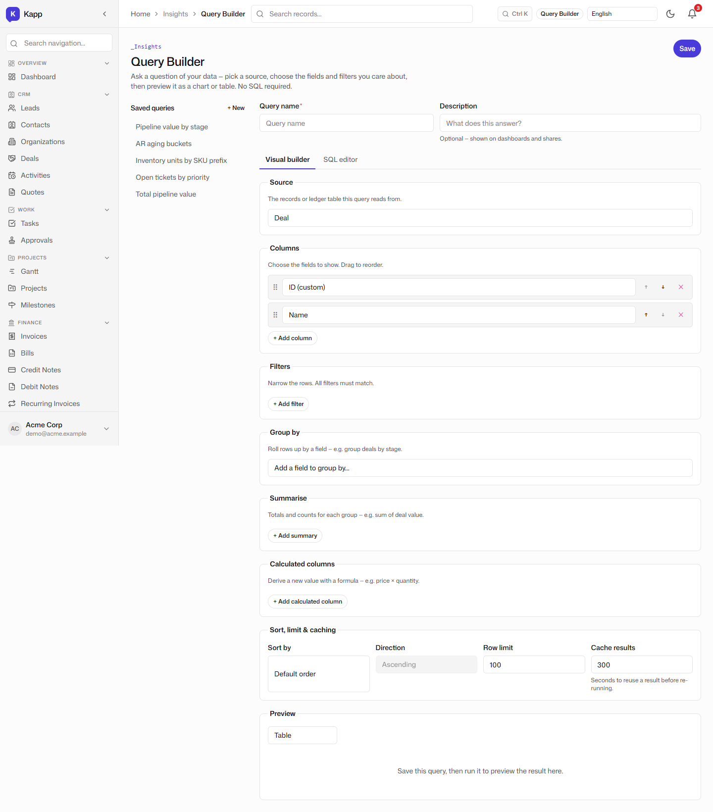
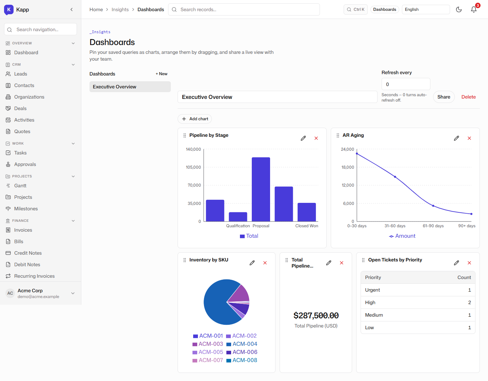
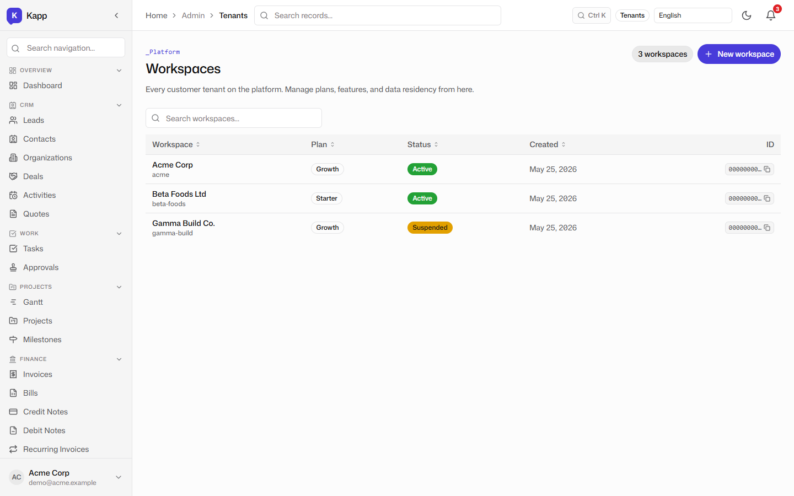
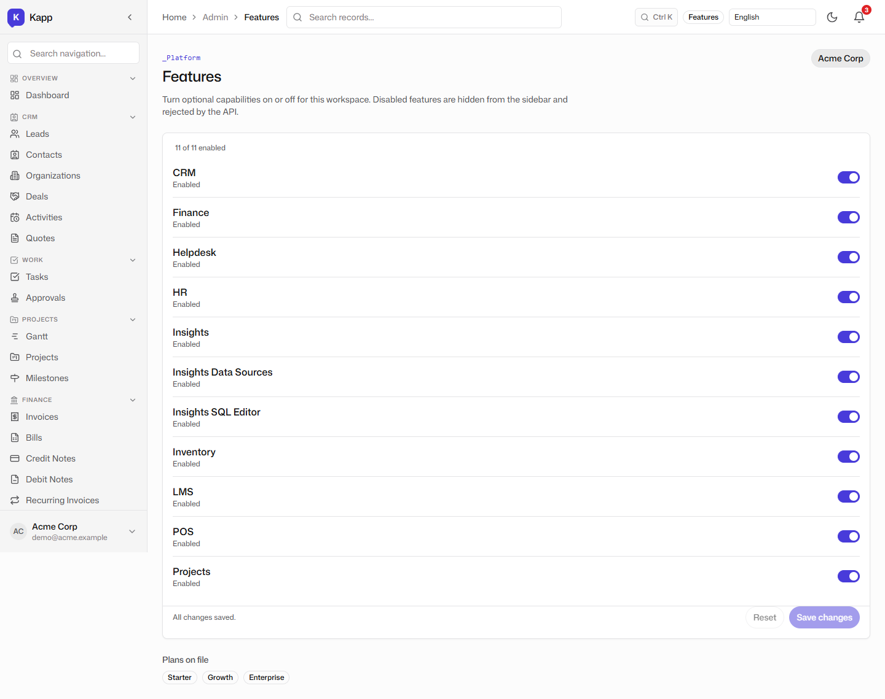
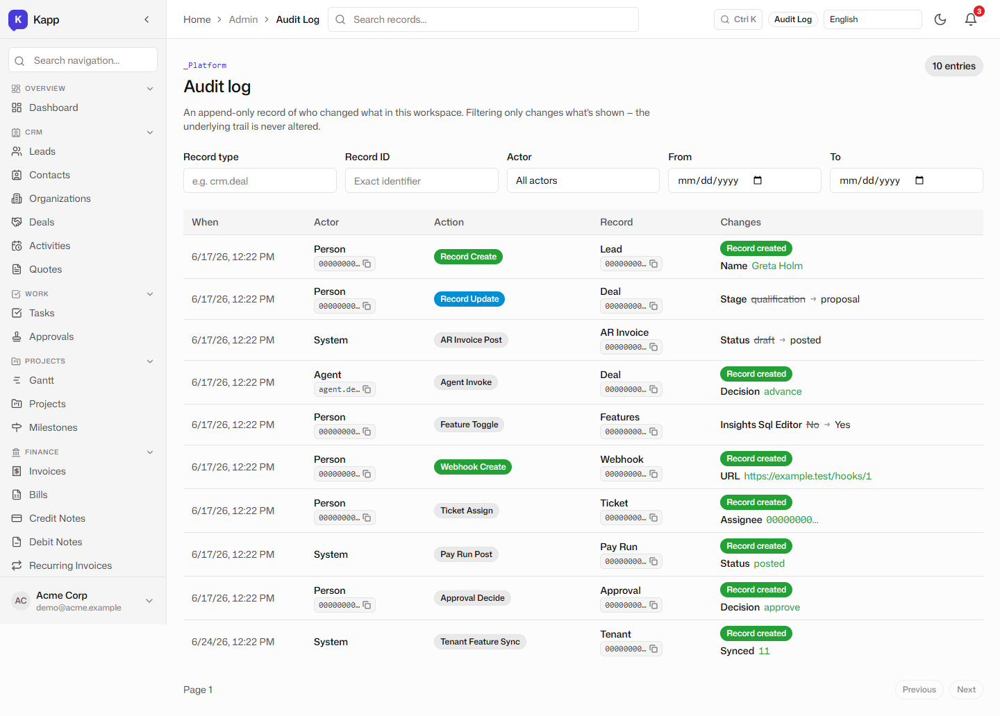
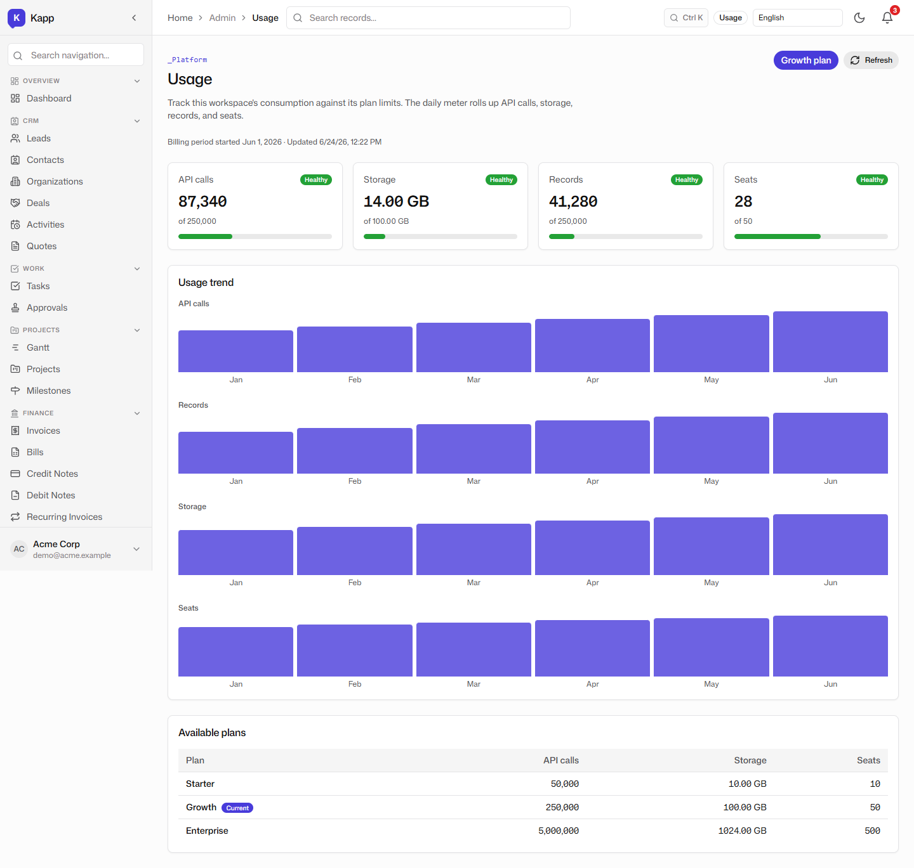
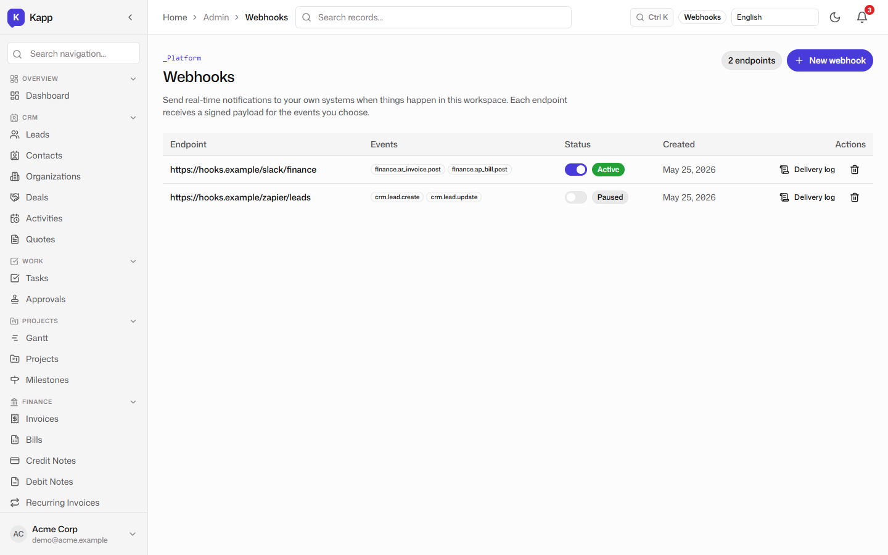
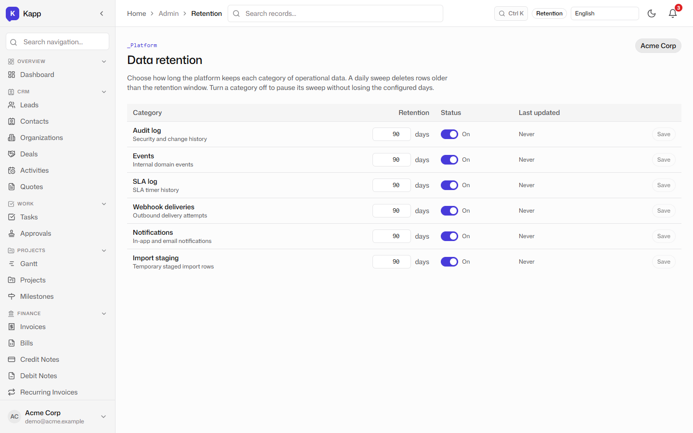
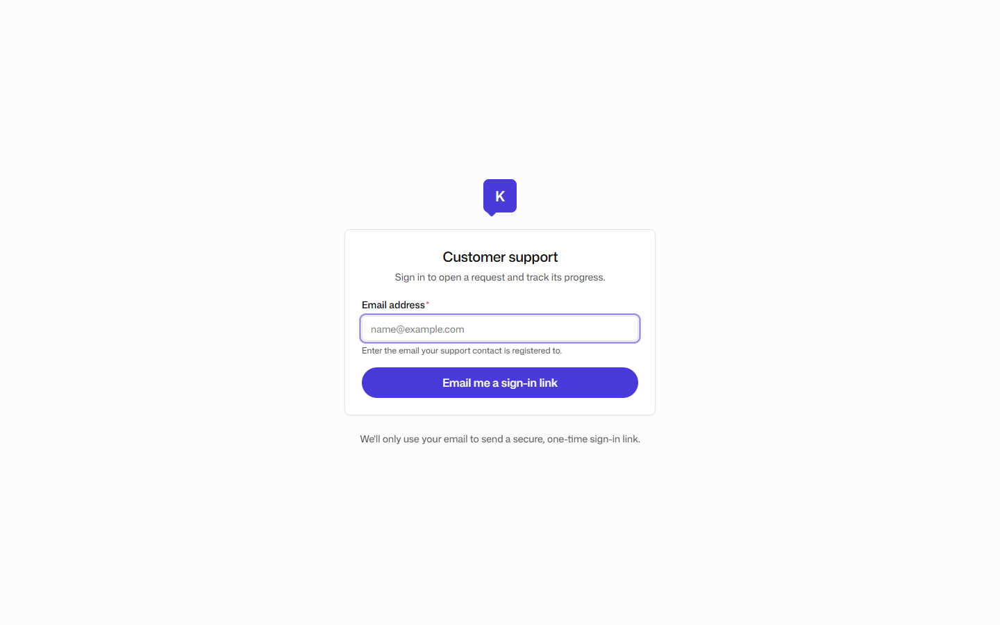
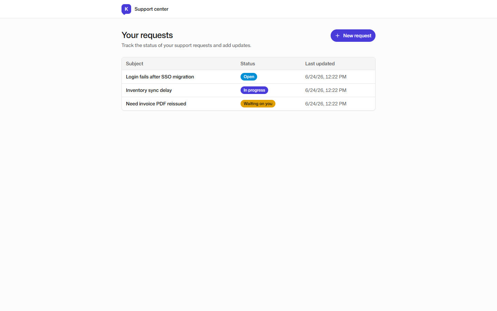

# Insights, Administration, and Customer Portal

**Tenant:** Acme Corp · USD · Multi-function SME demo
**Persona:** Sam, the platform administrator. His job-to-be-done: let people ask questions of the business data, govern the tenant, keep the lights on, and give customers a simple self-service window.

## The visual query builder

Insights starts with a query builder that lets users select a record type, choose columns and filters, and run the query without writing SQL. The demo shows a query over `crm.deal` grouped by stage, returning the pipeline value per stage. The same builder can query KRecords, typed ledgers, and the audit trail.

## Dashboards

Saved queries become widgets on a dashboard. The demo shows the Executive Overview dashboard with a pipeline-by-stage bar chart, an AR aging line chart, an inventory mix pie chart, and a number card for total pipeline value. Dashboards can be shared, scheduled, and refreshed, so the same answers do not have to be rebuilt every Monday morning.

## Tenant management

The admin surface shows the tenant list, including the seeded Acme Corp tenant and its plan. From here Sam can create tenants, manage billing tiers, and control the feature flags that gate each module. The same binary and database serve every tenant; isolation is enforced by row-level security in Postgres.

## Feature flags

Feature flags let Sam turn modules on or off per tenant. A business that only needs CRM and finance today can enable HR, LMS, or manufacturing later without redeploying code. The feature flags surface shows which capabilities are active for the current tenant and which are available in higher tiers.

## Audit log

Every create, update, state transition, and agent action is recorded in the audit log. The demo shows entries for lead creation, deal stage changes, invoice posting, feature toggles, and webhook creation. The log is append-only and tenant-scoped, so it can answer "who changed what, when?" under compliance scrutiny.

## Usage, webhooks, and retention

Usage reporting shows consumption over time, so Sam can track adoption and billing. Webhooks let external systems subscribe to events such as invoice posting or deal stage changes. Retention policies let Sam configure how long records and audit entries are kept.

## Customer portal

Finally, the customer portal gives Acme's external customers a branded login and a limited view of their own tickets. The demo shows the portal login page for the `acme` slug and the ticket list a customer would see after signing in. The portal is served from the same application but scoped to the customer's own records.

## Why this matters for an SME

A growing SME usually ends up with one tool for analytics, another for user management, a third for audit logs, and a fourth for customer self-service. Kapp combines these operational layers into one tenant-scoped administration surface. The value is not just fewer logins; it is that the admin surface, the query engine, and the customer portal all read from the same data model as the rest of the business.
