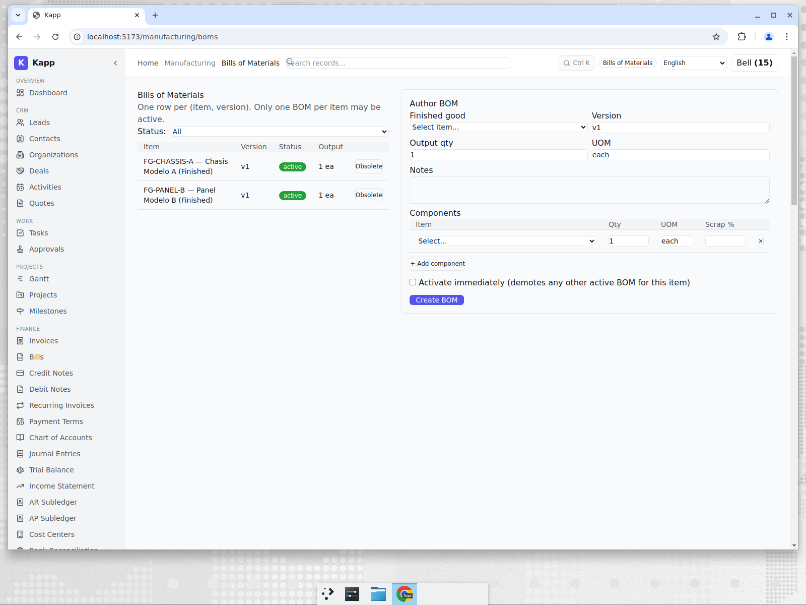
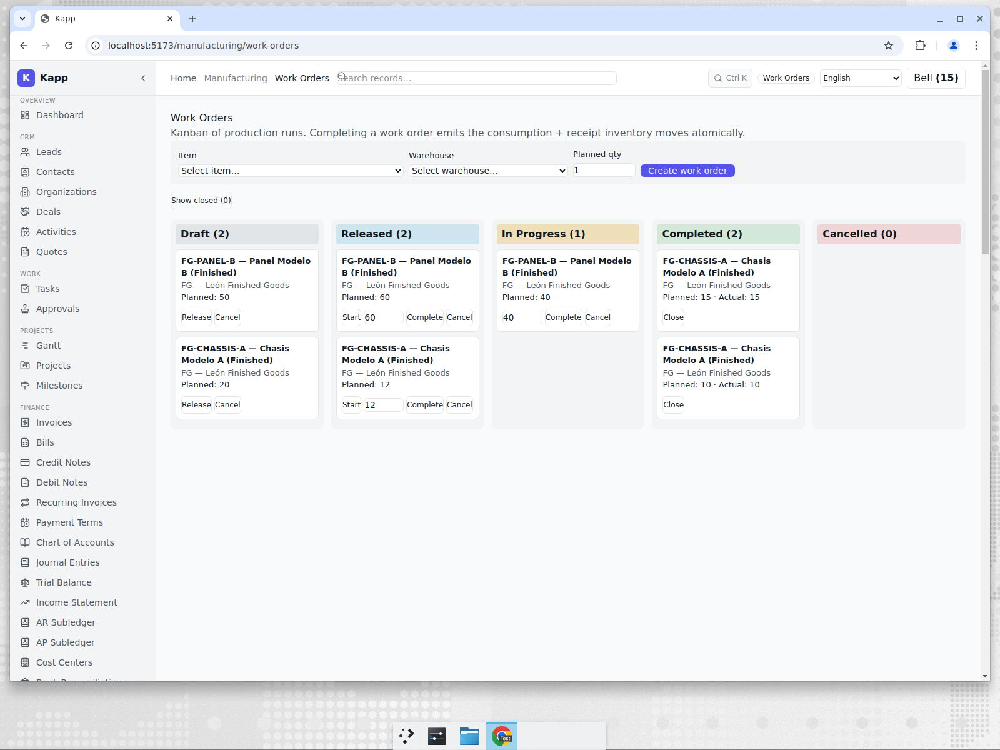
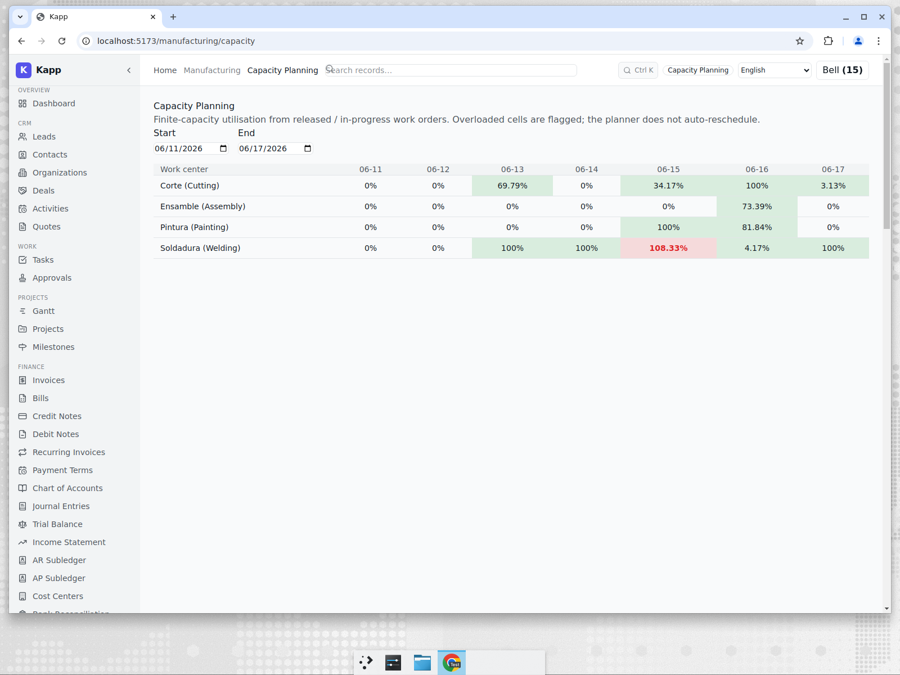
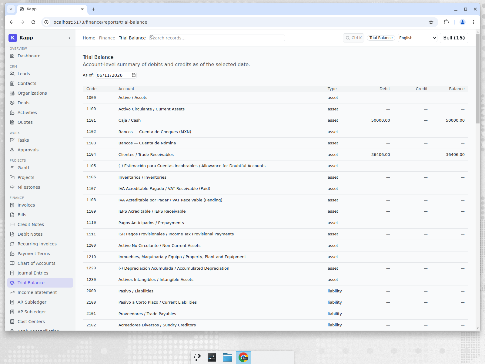

# Manufacturing for a Mexican Fab Shop

**Tenant:** Talleres del Bajío · 🇲🇽 Mexico · MXN · Manufacturing
**Persona:** Carlos, the plant manager in León. His job-to-be-done: turn raw steel and
aluminium into finished chassis and panels, know whether his shop floor can take on more
work this week, and keep books that survive a SAT audit.

## Bills of materials

Production starts with the recipe. Each finished good — *Chasis Modelo A*, *Panel
Modelo B* — has an active BOM listing the components and quantities, with scrap
percentages on the materials that get trimmed. Only one BOM per item can be active at a
time, so there is never ambiguity about which recipe the floor is building to.

## Work orders that move stock

Production runs are work orders on a kanban: **Draft → Released → In Progress →
Completed**. The crucial behaviour is at completion — finishing a work order emits the
component **consumption** and finished-goods **receipt** inventory moves *atomically*, in
one transaction. Either the whole production posting happens or none of it does.

In this snapshot Carlos has two completed runs (10 and 15 chassis, actuals recorded
against plan), one in progress, two released, and two still in draft — a realistic
week's board. When the qty-10 run completed, it drew down steel, aluminium, brackets,
bolts, and paint and booked 10 finished chassis, all from the active BOM.

## Can the floor take more work?

The capacity planner is where a plant manager earns his keep. It shows finite-capacity
utilisation per work centre per day, derived from released and in-progress work orders,
and **flags any cell that is overloaded.**

The red cell tells the story instantly: the Welding (*Soldadura*) work centre is booked
to 108% of capacity on June 15 — more work than the shift can physically do. The planner
does not silently re-shuffle the schedule; it surfaces the conflict so Carlos can decide
whether to add a shift, move a job, or push a delivery date. Cutting, painting, and
assembly are all within capacity, so he knows exactly where the bottleneck is.

## Books a Mexican accountant recognises

Because Bajío was set up with the Mexico tax pack, its chart of accounts is the real
thing: bilingual Spanish/English accounts for **IVA** and **IEPS**, **ISR** withholding,
and the full social-security stack — **IMSS**, **INFONAVIT**, **SAR**, state payroll tax
(**ISN**), and statutory profit-sharing (**PTU**). The trial balance ties out exactly,
in MXN.

## Why this matters for an SME

A small manufacturer is usually forced to choose between a cheap accounting tool that
knows nothing about the shop floor, and a heavy MRP/ERP (SAP Business One, Epicor) that
costs more than the shop can justify. Kapp puts BOMs, work orders, finite-capacity
planning, and SAT-compliant statutory books in one system priced for an SME.

The honest comparison — see [post 7](./07-competitive-analysis.md) — is that dedicated
MRP systems and Odoo's manufacturing module go further: backward scheduling, MRP
run/material planning, subcontracting, and quality workflows. Kapp deliberately covers
the core make-to-stock loop and the capacity *visibility* most small shops lack, rather
than full closed-loop MRP.
